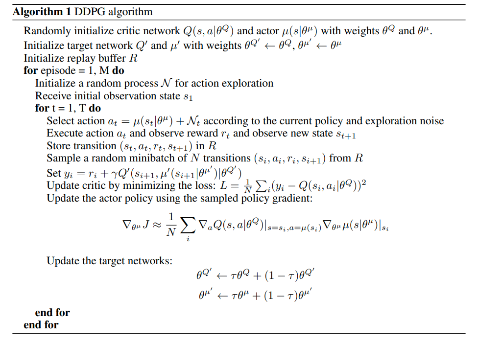

[HOME](../README.md)

### 3. DDPG

[Continuous control with deep reinforcement learning]

Timothy P. Lillicrap∗ , Jonathan J. Hunt∗ , Alexander Pritzel, Nicolas Heess, Tom Erez, Yuval Tassa, David Silver & Daan Wierstra (2016)

[paper_link](https://arxiv.org/pdf/1509.02971.pdf)

 

### [Abstract]

- <u>Deep Q-Learing에서의 성공의 기반이 되었던 주요 아이디어들을 채용해 **continuous action domain**으로 옮겼다.</u>

- deterministic policy gradient기반의 actor-critic, model-free 알고리즘이 continuous action spaces에서도 잘 돌아간다는 것 보인다.
- 동일한 학습 알고리즘, network 구조, hyper-parameter를 이용해 20가지가 넘는 물리 시뮬레이션 task를 모두 풀어냈다.
- 이 알고리즘은 이제 dynamics기반의 planning 알고리즘과 비교해 충분히 경쟁적인 성과를 내는 policy를 찾아낸다.

 

### [Introduction]

AI분야의 본래 목적 중 하나는 바로 **가공되지 않은 고차원의 센서 데이터를 이용해 복잡한 문제를 푸는 것**이라고 할 수 있다.

최근에는 센서데이터 처리를 위해 발전된 딥러닝 기술을 사용하기 시작했으며, 이것이 강화학습과 결합되어  Deep Q-Network가 탄생하게 되었다.

 

그러나 DQN은 high-dimensional observation spaces를 이용해 문제를 풀지만, **discrete하고 low-dimensional action spaces만을 다룰 수 있었다**.

때문에 DQN에서는 continuous domain문제에 적용하기 위한 방법으로 action space를 discrete한 action으로 쪼개어 적용하였다.

그러나 이러한 방법은 많은 **한계점(limitations)**을 지닌다. 바로 **차원의 저주(the curse of dimensionality)** 때문이다.

 

이 논문에서는 <u>deep function approximator를 이용한 model-free, off-policy actor-critic algorithm</u>을 제안한다. 

해당 논문에서는 deterministic policy gradient(DPG) 개념이 바탕이 되었는데,

고전적인 actor-critic방식에 neural function approximator를 결합하는 방식으로는 어려운 문제에 대해 상당히 불안정했다고 한다.

그래서 이번에는 **DQN에 적용되었던 Insights들을 actor-critic 방식에 적용**해 그 문제를 해결하였다.

 

DQN의 이전에는 large, non-linear function approximator가 어렵고 불안정하다는 사실이 일반적이었다.

하지만 DQN은 **두 가지 innovation**을 통해 stable하고 robust한 방법으로 이러한 function approximator를 이용하 value function을 학습시킬 수 있었다.

- 첫번째는, **replay buffer**를 이용해 관련성이 적은 sample들만을 off-policy 방법으로 network를 학습시킨다.

- 두번째로, **target Q network**를 이용해  TD backup(update)을 하는 동안에 target에 대한 일관성을 유지시켜준다.

또한, 이 논문에서는 위 두가지 아이디어와 함께 **batch normalization** 개념이 함께 적용되었으며 

이것이 바로 논문의 결과물인  **Deep DPG(DDPG)** model-free approach이다.

 

### [Background]

#### **Notation**

 

action-value function은 많은 강화학습 알고리즘에서 사용된다. 

이는 아래의 식과 같이 policy를 따라 방문하게되는 action, state에서 얻게 될 모든 return의 기댓값이다.
$$
Q^\pi(s_t,a_t) = \mathbb{E}_{r_{i\geq t},s_{i>t}\sim E,a_{i>t}\sim\pi}[R_t|s_t,a_t]
$$
위 식은 일반적으로 **Bellman Equation**이라 알려져있는 recursive relationship 방식으로 표현되곤 한다.
$$
Q^\pi(s_t,a_t) = \mathbb{E}_{r_t,s_{t+1}\sim E}[r(s_t,a_t) + \gamma\mathbb{E}_{a_{t+1}\sim\pi}[Q^\pi(s_{t+1},a_{t+1})]]
$$
만약 target policy가 deterministic하다면 action-value function 식 내부의 기댓값을 없앨 수 있으며 policy 역시 다음과 같이 표현된다.
$$
\text{policy: } \mu:S\gets A
\\Q^\mu(s_t,a_t) = \mathbb{E}_{r_t,s_{t+1},\sim E}[r(s_t,a_t) + \gamma Q^\mu(s_{t+1},\mu(s_{t+1}))]
$$
기댓값은 오직 환경(state,reward)에만 의존적이다.

이는 또다른 stochastic behavior policy로부터 생성된 sample을 이용해 off-policy방식으로 위 함수를 학습할 수 있음을 의미한다.

 

우리는 위 action-value function을 근사할 **function approximator를 파라미터화** 하여 생각해 볼 수 있을 것이다.

또한 근사함수를 최적화 하기위해 아래 식을 이용해 loss를 구하고 이를 최소화 해야만 한다.
$$
L(\theta^Q) = \mathbb{E}_{s_t\sim\rho^\beta,a_t\sim\beta,r_t\sim E}[(Q(s_t,a_t|\theta^Q)-y_t)^2]
\\\text{where } y_t = r(s_t,a_t) + \gamma Q(s_{t+1},\mu(s_{t+1})|\theta^Q)
$$
 

value function이나 action-value function을 학습하기 위해 large, non-linear function approximator를 사용하는것은 예전부터 기피의 대상이었다.

가능성을 보장할 수 없을 뿐더러 실제로 불안정한 경향이 있었기 때문이다.

하지만 근래에 large neural network를 function approximator로서 효과적으로 사용한 DQN이 등장했으며,

그를 성공시킬 수 있었던 주요 아이디어로 ***replay buffer*와 *target network***가 소개되었다.

 

이 논문에서는 DDPG에 이러한 개념들을 적용하였으며 상세한 내용은 다음 섹션에서 소개된다.

 

### [Algorithm]

<u>Q-learning을 continuous action spaces로 그대로 적용하기는 불가능했다</u>.

greedy policy로 continuous spaces를 탐색하기에는 매 스탭마다 모든 action에 대해 optimization을 진행해야했고,

이 과정이 large, unconstructed function approximator에 적용하기에는 **매우 느렸기 때문**이다. 

 

그 대신에 이 논문에서는 DPG algorithm의 기반이 되는 **actor-critic 방식**을 이용했다.

DPG에서는 actor function을 파라미터화하여 관리하였고, actor의 policy에서는 state와 특정 action을 직접적으로 연결해주었다.

critic은 bellman equation을 이용한 Q-learning 방식으로 학습되었고, actor는 policy performance의 gradient 방향으로 update 되었다..
$$
\nabla_{\theta^\mu}J \approx \mathbb{E}_{s_t\sim\rho^\beta}[\nabla_{\theta^\mu}Q(s,a|\theta^Q)|_{s=s_t,a=\mu(s_t|\theta^\mu)}]
\\ = \mathbb{E}_{s_t\sim\rho^\beta}[\nabla_a Q(s,a|\theta^Q)|_{s=s_t,a=\mu(s_t)}\nabla_{\theta^\mu}\mu(s|\theta^\mu)|_{s=s_t}]
\\\text{<gradient of the policy's performance>}
$$
 

Q-learning과 함께 non-linear function approximator를 사용한다는 것은 '수렴을 보장하지않는다' 라는 것을 의미한다.

그러나 **large state spaces에 대해 일반화를 하고 학습을 시키기 위해서는 이러한 approximator가 필수적**이다.

*NFQCA(Hafner & Riedmiller, 2011)* 에서는 DPG와 같은 update rule을 사용하였지만 neural function approximator를 사용하였다.

안정화를 위해 batch learning을 사용했지만 large network에서는 사용하기가 어려웠다.

 

이 논문의 contribution은 <u>DQN이 성공할 수 있었던 요인들을 착안하여 DPG를 조금 개선한 것</u>이다.

이것을 이 논문에서는 **Deep DPG(DDPG)**라 부른다.

 

### [Results]

 

### [Related Work]

 

### [Conclusion]

