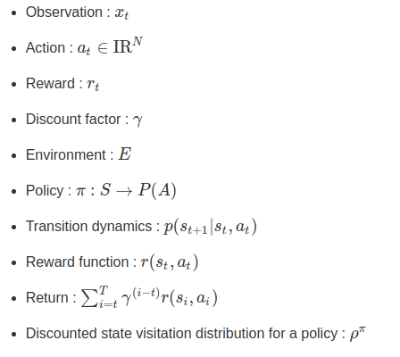

[HOME](../README.md)

### 3. DDPG

[Continuous control with deep reinforcement learning]

Timothy P. Lillicrap∗ , Jonathan J. Hunt∗ , Alexander Pritzel, Nicolas Heess, Tom Erez, Yuval Tassa, David Silver & Daan Wierstra (2016)

[paper_link](https://arxiv.org/pdf/1509.02971.pdf)

 

### [Abstract]

- <u>Deep Q-Learing에서의 성공의 기반이 되었던 주요 아이디어들을 채용해 **continuous action domain**으로 옮겼다.</u>

- deterministic policy gradient기반의 actor-critic, model-free 알고리즘이 continuous action spaces에서도 잘 돌아간다는 것 보인다.
- 동일한 학습 알고리즘, network 구조, hyper-parameter를 이용해 20가지가 넘는 물리 시뮬레이션 task를 모두 풀어냈다.
- 이 알고리즘은 이제 dynamics기반의 planning 알고리즘과 비교해 충분히 경쟁적인 성과를 내는 policy를 찾아낸다.

 

### [Introduction]

AI분야의 본래 목적 중 하나는 바로 **가공되지 않은 고차원의 센서 데이터를 이용해 복잡한 문제를 푸는 것**이라고 할 수 있다.

최근에는 센서데이터 처리를 위해 발전된 딥러닝 기술을 사용하기 시작했으며, 이것이 강화학습과 결합되어  Deep Q-Network가 탄생하게 되었다.

 

그러나 DQN은 high-dimensional observation spaces를 이용해 문제를 풀지만, **discrete하고 low-dimensional action spaces만을 다룰 수 있었다**.

때문에 DQN에서는 continuous domain문제에 적용하기 위한 방법으로 action space를 discrete한 action으로 쪼개어 적용하였다.

그러나 이러한 방법은 많은 **한계점(limitations)**을 지닌다. 바로 **차원의 저주(the curse of dimensionality)** 때문이다.

 

이 논문에서는 <u>deep function approximator를 이용한 model-free, off-policy actor-critic algorithm</u>을 제안한다. 

해당 논문에서는 deterministic policy gradient(DPG) 개념이 바탕이 되었는데,

고전적인 actor-critic방식에 neural function approximator를 결합하는 방식으로는 어려운 문제에 대해 상당히 불안정했다고 한다.

그래서 이번에는 **DQN에 적용되었던 Insights들을 actor-critic 방식에 적용**해 그 문제를 해결하였다.

 

DQN의 이전에는 large, non-linear function approximator가 어렵고 불안정하다는 사실이 일반적이었다.

하지만 DQN은 **두 가지 innovation**을 통해 stable하고 robust한 방법으로 이러한 function approximator를 이용하 value function을 학습시킬 수 있었다.

- 첫번째는, **replay buffer**를 이용해 관련성이 적은 sample들만을 off-policy 방법으로 network를 학습시킨다.

- 두번째로, **target Q network**를 이용해  TD backup(update)을 하는 동안에 target에 대한 일관성을 유지시켜준다.

또한, 이 논문에서는 위 두가지 아이디어와 함께 **batch normalization** 개념이 함께 적용되었으며 

이것이 바로 논문의 결과물인  **Deep DPG(DDPG)** model-free approach이다.

 

### [Background]

***Notations***

 

### [Algorithm]

 

### [Results]

 

### [Related Work]

 

### [Conclusion]

