[HOME](../README.md)

### DPG

[Deterministic policy gradient algorithms]

Silver, D., Lever, G., Heess, N., Degris, T., Wierstra, D., & Riedmiller, M. (2014).

[paper_link](http://proceedings.mlr.press/v32/silver14.pdf)

 

### [Abstract]

- 해당 논문에서는 continuous action을 다루는 RL을 위한, ***deterministic* policy gradient algorithm**을 다룬다. 
  - 이는 action-value function의 expected gradient의 형태로 나타나며, 일반적인 stochastic PG에서보다도 효과적으로 추정될 수 있다.

- 또한, 적절한 탐험(새로운 states 경험)을 보장하기 위해 **off-policy actor-critic 방법**을 소개한다.

- 마지막으로, **high-demensional action spaces**에서 stochastic 방식보다 **deterministic PG가 훨씬 뛰어남을 증명**한다.

 

### [Introduction]

Policy Gradient 알고리즘은 일반적으로 stochastic한 정책을 통해 샘플링을 한 후 보다 나은 reward를 얻을 수 있는 방향으로 정책파라미터를 조정한다.

반면, 이 논문에서는 deterministic policy를 다루며, 마찬가지로 policy gradient방향으로 정책 파라미터를 조절한다.

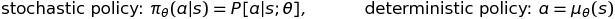

deterministic policy gradient는 간단한 model-free의 형태로 존재하는데, 이는 action-value function의 gradient를 따른다.

또한, 이 논문에서는  deterministic policy gradient가 stochastic policy gradient의 특별한 케이스(policy의 varience가 0에 수렴)임을 보일 것이다.

 

stochastic 과 determisitic policy 사이에 결정적인 차이가 존재하는데,

stochastic의 경우에는  policy gradient가 **state와 action spaces 모두와 연관**되어있는 반면에, deterministic의 경우는 **오직 state space와 연관**되어있다는 것이다.

그 결과, stochastic policy gradient를 구하기 위해서는 보다 더 많은 states 샘플을 요구하게 될 것이다. 특히 high-demensional action spaces의 경우에서 말이다.

 

모든 state와 action을 탐험하기 위해서는, stochastic policy방법이 필수적이다.

이 논문에서는 deterministic policy gradient알고리즘이 충분히 탐험(새로운 states를 경험)을 지속할 수 있도록 **off-policy learning algorithm**을 제시한다.

이 알고리즘의 기본적인 아이디어는 **stochastic behaviour policy에 따라 action을 선택**하되, **deterministic target policy를 이용해 학습**을 한다는 것이다.

 

이 논문에서는 **off-policy actor-critic algorithm**을 유도하기위해 deterministic policy gradient를 사용한다. 

여기서 off-policy actor-critic algorithm은 미분가능한 근사함수를 이용해 action-value function을 추정하고, 

근사된 action-value gradient의 방향으로 policy parameter를 업데이트 한다. 

 

또한, deterministic policy gradient를 근사하기위해 SPG와 마찬가지로(내용은 다르겠지만) **compatible function**을 소개한다.

이는 policy gradient가 biased-estimated 되지 않았음을 보이기 위함이다.

 

### [Background]

#### Preliminaries

일반적인 stochastic policy가 정의된 MDP에서 우리는 아래와 같이 **performance objective**를 정의할 수 있으며,

expectation의 형태로 나타낼 수 있다. (변수설명은 논문 참조)

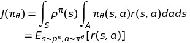

 

#### Stochastic Policy Gradient Theorem

**Policy Gradient** algorithms은 continuous action reinforcement learning algorithm에서 가장 유명한 알고리즘일 것이다.

이 알고리즘의 주된 아이디어는 정책파라미터인 theta를 아래의 **performance gradient**의 방향으로 조정하는 것이다. 

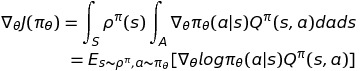

policy gradient알고리즘은 놀라울정도로 간단하다.

state distribution은 정책파라미터에 연관성이 있는데도 불구하고, state distribution의 gradient와 policy gradient는 서로 무관하다.

위 사실은 performance gradient를 계산할 필요없이 sampling을 통해 expectation을 구할 수 있도록 도와주었다.

이 덕분에 다양한 policy gradient algorithm들이 유도되기 시작하였고, 

이러한 알고리즘들을 다루기 위해서는 **action-value funciton을 어떻게 추정할 것인가**에 대한 문제로 귀결되었다.

 

#### Stochastic Actor-Critic Algorithms

**actor-critic** 알고리즘은 policy gradient기반의 구조에서 가장 널리 쓰이며, actor와 critic 두가지 요소로 이루어져있다.

 

**actor**는 performance gradient의 stochastic gradient ascent를 이용해 stochastic policy를 조절하며, 

알려지지 않은 action-value function을 파라미터로 근사해  대체한다.

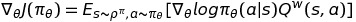

**critic**은 action-value function을 적절한 정책 평가 알고리즘(e.g. temporal-difference learning)으로 추정한다.

일반적으로 action-value function을 function approximator로 대체하는 것은 bias하다고 알려져있으나,

function approximator가 **compatible** 하다면 bias하지 않다.

 

여기서 compatible한 funciton approximator의 조건은 다음과 같다.

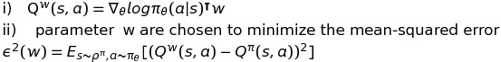

 

#### Off-Policy Actor-Critic

별도의 behaviour policy로부터 trajectories를 sampling하는 **off-policy** 방식의 policy gradient algorithm은 종종 유용하게 사용된다.

일반적인 off-policy 방법에서, **performance objective**는 아래의 식과 같이 

behaviour policy의 state distribution에 대해 averaged된 target policy의 value function으로 수정된다.(???한국어로 어떻게 번역을해야할까)

(참고: modified to be the value function of ther target policy, averaged over the state distribution of the behaviour policy)

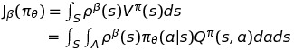

또, 이에 대해 미분된 performance objective는 **off-policy policy-gradient**로 근사된다.

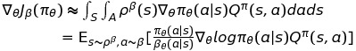

위 식의 근사는 [(Degris 2012b)](https://arxiv.org/abs/1205.4839) 이 논문에 근거한 근사이며, action-value gradient과 연관된 term이 제거된 것이다.

위 논문에 의하면 이러한 approximation이 gradient ascent가 수렴하는 방향으로 local optima가 형성되므로 충분히 좋은 근사라고 주장한다.

 

위 논문에서 소개된, **Off-Policy Actor-Critic(OffPAC)**은 behaviour policy를 사용해 trajectories sample을 생성한다.

**critic**은 이 때 생성된 trajectories로부터 off-policy로 state-value function을 추정해내며,

이때 gradient temporal-difference learning을 사용한다.

또한, **actor**는 trajectories로부터 off-policy로 target policy의 파라미터를 업데이트 시킨다.

이때는 stochastic gradient ascent를 이용해 업데이트한다.

 

여기서 actor와 critic은 behaviour policy가 아닌 target policy를 사용했다는 것을 반영하기위해,

**importance sampling ratio**를 사용한다.

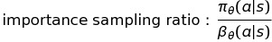

 

### [Gradients of Deterministics Policies]

이 장에서는 어떻게 policy gradient framework이 deterministic policy까지 확장되는가를 보인다.

먼저, deterministic policy gradient에 담긴 이론적인 것들을 전달하고, 이를 증명한다.

마지막으로, deterministic policy gradient theorem이 사실은 stochastic policy gradient theorem의 특수 케이스임을 보인다.

 

#### Action-Value Gradients

model-free RL algorithm은 주로 일반화된 policy iteration 기법을 기반으로 두고있으며,

이는 **policy evaluation** 과  **policy improvement**로 이루어져있다.

 

**policy evalution** 방법은 Monte-Carlo evaluation 이나 temporal-difference learning 방법 등으로 action-value function을 추정한다.

**policy improvement** 방법은 추정된 action-value function에 의해 policy가 업데이트 되며, 

주로 action-value function의 greedy maximization방법으로 업데이트한다.

 

하지만 continuous action spaces에서는 이러한 방식의 policy improvement는 매 스텝 global maximization을 요구하기에 문제가 많았다.

그 대신에 간단하고 계산적으로도 매우 좋아보이는 대안이 있는데, 바로 **Q-function의 gradient 방향으로 policy를 업데이트** 하는 것이다.

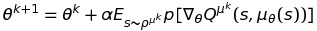

이러한 방식은 매 state마다 다른 방향으로의 policy improvement가 진행되며, 이들은 state distribution에 대한 기대값으로 취해져 평균치를 이룰 것이다.

 

또한, chain rule의 적용을 통해 위 식을 action에 대한 action-value function과 policy parameter에 대한 policy gradient로 나눌 수 있다.

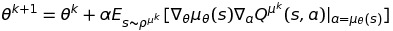

하지만, policy의 변화에 의해 방문하게되는 states가 바뀌게 되고 결국  state distribution이 변할것이다. 

이는 결국 distribution에 대한 변화를 모두 설명하지 못하고서는 improvement를 보장할 수 있다기에 불확실함을 가진다고 생각될 것이다. 

그러나, stochastic policy gradient theorem에서 보여진 것과 같이 **state distribuiton의 gradient는 계산할 필요가 없다**.

따라서, 위 식에서 보여진 직관적인(?) 업데이트방식은 분명 performance objective의 gradient를 따르니 걱정하지 말도록하자.

 

#### Deterministic Policy Gradient Theorem

stochastic policy와 유사한 방법으로 performance objective를 표현하자면 다음의 식과 같다.

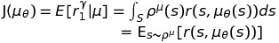

또한, 해당 performance objective를 지난번에 리뷰한 Sutton의 논문과 유사한 방식으로 policy gradient를 유도해 낸다.

해당 증명은 Appendix에 증명되어 있으며, 그 결과는 아래 식과 같다.

 

**Theorem 1** Deterministic Policy Gradient Theorem

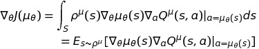

위 식에서도 나타나듯이, expectation값을 구할 때 모든 **state에 대해서만 고려해주면 되는 것이 해당 Theorem의 장점**이다.

stochastic 방식은 state와 action에 대한 기댓값을 구해야 하기 때문에 deterministic방식이 더욱 효율적이라는 것이다.

 

#### Limit of the Stochastic Policy Gradient 

이 논문에서는 deterministic policy gradient가 사실은 stochastic policy gradient의 스페셜케이스이라는 사실을 보인다.(Appendix C 참고)

 

deterministic policy로 파라미터화된 stochastic policy가 있다고 가정하자.

그리고 이 policy의 variance parameter가 0에 수렴할 때, stochastic policy와 deterministic policy가 동등하며.

이때 stochastic policy gradient와 deterministic policy gradient 역시 동일하게 수렴한다.

 

**Theorem 2** 

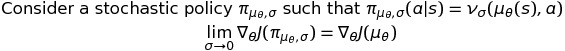

이 사실을 통해 deterministic policy gradient가 stochastic policy gradient의 한 부분이므로,

그동안 policy gradient에 적용되었던 모든 이론적 내용들이 **deterministic policy에도 호환 가능**하다는 사실을 나타낸다. 

 

### [Deterministic Actor-Critic Algorithms]

이번 절에서는 on-policy와 off-policy actor-critic 알고리즘에 deterministic policy gradient를 사용한다.

첫번째로, 쉬운 예를 들기 위해 간단한 **SARSA critic방법을 이용해 on-policy 업데이트**를 진행하며

다음으로, **Q-learning critic을 사용해 off-policy 업데이트**를 진행해 이 논문의 메인 아이디어를 전달한다.

 

이러한 알고리즘들은 결국 실질적인 문제점들을 마주치게 된다.

바로 Function Approximator의 **편향성(bias)**과 off-policy learning으로 부터 야기된 **불안정함(high-varience)**이다.

때문에 보다 이론적인 접근으로 **compatible function approximation**과 **gradient temporal-difference learning**을 소개한다.

 

#### On-Policy Deterministic Actor-Critic

일반적으로, deterministic policy를 따라 행동하면 **충분한 exploration을 보장할 수 없으며, local-optima로 유도되곤 한다**.

그럼에도 불구하고 SARSA actor-critic(on-policy actor-critic)을 첫번째 예로 든 이유는 교육적인 것(**쉬운 설명**을 위해)이 주된 목적이다.

하지만, **충분한 노이즈가 있는 환경**에서의 학습시킨다면 deterministic policy를 이용하더라도 충분히 탐험하는 효과가 있을 것이니 유용한 방법일 수 있다.

 

stochastic actor-critic에서와 마찬가지로 deterministic actor-critic에도 **actor와 critic** 두가지 요소를 가지고 있다.

critic은 action-value function을 추정하며, actor는 action-value function의 gradient를 최대화하는 방식이다.

특히, actor는 deterministic policy의 **파라미터를 stochastic gradient asent 방식으로 업데이트** 하게된다.

또한, action-value function은 미분 가능한 근사함수로 대체되며 critic은 이를 근사/추정 한다.

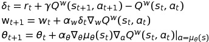

 

#### Off-Policy Deterministic Actor-Critic

이번엔 off-policy 방법과 deterministic actor-critic을 결합하는 방법을 소개한다.

off-policy deterministic actor-critic은 [off-policy stochastic actor-critic](#off-policy-actor-critic)에서 소개된 방법과 마찬가지로 

**임의의 stochastic behavior policy에 의해 생성된 trajectories를 통해 deterministic target policy를 학습**한다.

 

또한, performance objective를 behavior policy의 state distribution에 대해 averaged된 target policy에 대한 value-function식으로 변형한다.

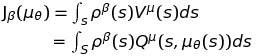

아래 주어진 식이 바로 off-policy deterministic policy gradient이다.

stochastic 방식과 마찬가지로 action-value gradient term이 제거해 근사한 것이다. [(Degris 2012b)](https://arxiv.org/abs/1205.4839)

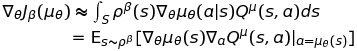

이제는 actor-critic 알고리즘을 전개할 차례이다. 즉, **policy를 off-policy deterministic policy gradient의 방향으로 업데이트** 하는 것이다.

물론 이번에도 action-value function을 미분가능한 근사함수로 대체하며, **critic은 behavior policy에 의해 생성된 trajectories를 이용해 이를 추정**한다.

해당 논문에서는 아래 주어진 <u>*off-policy deterministic actor-critic(OPDAC)*</u>와 같이 critic이 Q-learning update를 사용하였다.

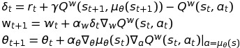

또한, 여기서 주목해야하는 사실은 위 식에서는 importance sampling이 보이지 않는다는 것인데,

일반적인 off-policy 알고리즘과는 다르게, deterministic gradient에서는 **action에대한 적분항이 없기 때문에 actor에서 importance sampling이 필요없다**.

게다가 **Q-learning방식의 update를 사용하는 critic역시 importance sampling term을 제거할 수 있다**.

 

#### Compatible Function Approximation

stochastic case와 비슷하게 compatible function approximator를 찾아 deterministic policy gradient 식 내부의 action-value값을 대체해야 한다.

즉, **deterministic policy gradient에 영향을 주지 않으면서 근사함수의 gradient로 action-value gradient를 대체할 수 있는 critic**을 찾아야함을 의미한다.

 다음의 수식은 on-policy와 off-policy에 모두 적용되는 Theorem이다.

**Thoerem 3.** 

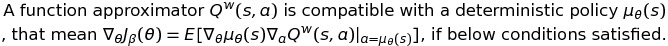

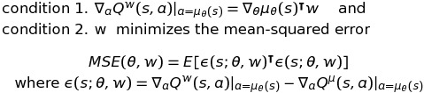

(증명은 논문에 간단히 정리되어있다.)

 

*[Basis for condition 1]*

모든 deterministic policy는 다음과 같은 **compatible function approximator form**이 존재한다.

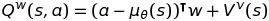

여기서 뒤에 붙은 term은 미분 가능한 baseline함수이며 action과 독립적으로 작용하는 **value-function**이다.

예를 들면, 파라미터 v에 대해 아래 식과 같은 형태로 볼 수 있다.

반면, 첫번째 항은 특정 상태 s에서의 deterministic policy 액션 a를 취하는 **advantage-function**을 추정한 것이다.

advantage function은 다음과 같은 형태의 linear function approximator로 볼 수 있다.

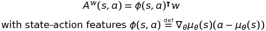

<u>이러한 형식의 function approximator는 Theorem 3의 condition 1을 만족한다.</u>

 

linear function approximator는 global하게는 action-value를 예측하는데에 그리 효과적이지는 않다.

매우 큰 action에 대해서는 action-value가 발산하는 경향이 있기 때문이다.

하지만, local critic으로서는 매우 효과적이다. 특히 <u>현재의 policy로부터 생기는 작은 편차들의 local advantages를 효과적으로 표현</u>해준다.

결과적으로 **linear function approximator는 actor가 policy parameter를 학습시키기 위한 방향을 고르기에 충분**하다.

 

[*Basis for condition 2*]

condition 2를 만족시키기 위해서는 **근사함수의 gradient와 true gradient 사이의 MSE가 최소화 되는 parameter w**를 찾아야 한다. 

이 문제는 features(trajectories)와 targets(true gradient)사이의 linear regression 문제라고 볼 수 있다.

 

하지만, true gradient의 unbiased sample을 얻는것은 만만치 않은 문제이다.

실제로 condition1을 만족시키기위해 linear function approximator를  사용하였지만,

**일반적인 policy evaluation방법(Q-learning, SARSA)을 사용해 parameter w를 학습시켰을 때에는 condition 2 를 만족시키지 못했다.** 

 

논문에서는 차례로 policy evaluation problem에 대해서 합리적인 대안을 보여준다.

아래 소개된 ***compatible off-policy deterministic actor-critic***(COPDAC)에는 역시 두가지 요소로 구성되어있다.

1. *critic은 linear function approximator로서 features로부터 action-value를 추정한다.*

   
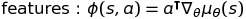

​		물론 이는 behavior policy의 sample을 이용해 off-policy로 학습(Q-learning 또는 gradient Q-learning 이용)된 것이다.

2. *그 때 actor는 critic의 action-value gradient의 방향으로 파라미터를 업데이트 한다.*

아래 식은 간단한 Q-learing critic을 사용한 COPDAC-Q 알고리즘을 나타낸다.

그런데 **off-policy Q-learning은 linear function approximator를 사용하였을 때에 발산**한다고 알려져있다.

 

최근에 더욱 자주 사용되는 방법은 <u>**gradient temporal-difference learning기반**</u>의 true gradient descent 알고리즘이며, 이는 수렴을 보장하는 특성이 있다.

이러한 방법들의 기본 아이디어는 mean-sqaured projected Bellman error(MSPBE)를 stochastic gradient descent방법을 사용해 최소화하는 것이다.

마찬가지로 이 논문에서도 gradient TD-learning을 이용하였으며, 그중에서도 **gradient Q-learning을 이용**하였다.

또한,  actor보다 critic이 시간적으로 빠르게 수렴할 수 있도록 step-size, learning-rate 등을 적절히 맞추어 준다면 파라미터의 MSPBE는 최소화되도록 수렴할 것이다.

 

아래 수식은 COPDAC 알고리즘에 gradient Q-learning critic을 적용한 **COPDAC-GQ algorithm**이라 부른다.

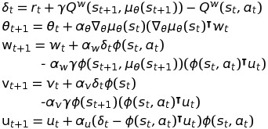

* stochastic actor-critic과 마찬가지로, 모든 파라미터를 업데이트 하는데에 필요한 computational complexity는 O(mn) 정도이다.

 

마지막으로, 이 논문에서는 natural policy gradient가 deterministic policy로 확장될 수 있음을 보인다.

natural gradient는 바로 Fisher Information metric에 대한 steepest ascent direction이다.

이 metric은 policy가 reparameterization되어도 불변하는 특성을 지니고 있다.

deterministic policy에 적용해보기 위해 <u>Fisher Information metric</u>을 아래와 같이 정의할 수 있으며,

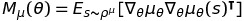

 

이는 **policy의 분산이 0인 Fisher information metric**를 나타내는 등 특별한 케이스임을 보여준다.

 

deterministic policy gradient theorem과 compatible function approximation를 결합하여 아래오 같은 수식을 얻어낼 수 있으며,

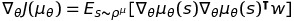

steepest ascent diretion은 다음과 같이 간단히 나타낼 수 있다.

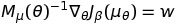

또한 이를 이용해 actor를 업데이트 하고자 할 때에는 간단히 아래 수식을 사용해 업데이트가 가능하다.

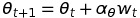

