[HOME](../README.md)

### 6. GAE

[High-Dimensional Continuous Control Using Generalized Advantage Estimation]

John Schulman, Philipp Moritz, Sergey Levine, Michael I. Jordan and Pieter Abbeel(2016)

[paper_link](https://arxiv.org/pdf/1506.02438.pdf)

 

- 참고할만한 링크:
  - https://m.blog.naver.com/PostView.nhn?blogId=kwonpub&logNo=221298006981&proxyReferer=https:%2F%2Fwww.google.com%2F
  - https://daeson.tistory.com/334

### [Abstact]

policy gradient method은 RL에서 아주 매력적인 접근법이다.

그 이유는

1. neural network를 nonlinear function estimator로 바로 사용가능하며,

2. 누적 reward를 직접적으로 최적화 할 수 있도록 만들어준다.

 

하지만, 두가지 아주 중요한 challenges가 남아있는데,

1. 보통 아주 많은 수의 sample을 요구하며,(sample complexity가 높기 때문)
2. input data가 non-stationary하지 않는데 stable하고 steady한 improvement를 얻기가 너무 어렵다는 것이다.

 

이 논문에서는 첫번째 문제를 다루기 위해 policy gradient estimation의 variance를 줄여주는 value function을 사용한다.(약간의 bias를 가지게된다). 이 value funtion은 TD lambda와 유사한 advantage funtion의 exponentially-weighted estimator를 사용한다.

다음으로 두번째 문제를 해결하기 위해 policy와 value function의 업데이트를 위해 trust region optimization을 이용한다.

 

이러한 접근법을 통해 highly challenging 3D locomotion tasks에 대해 아주 좋은 결과들을 도출해 내었다.(learning gaits for bipedal, quadrupedal, learning standing up motion for biped)

지난 결과물들은 직접 policy가 나타내는 것을 직접 연결해줘야 했던것에 비해 이들은 fully-model-free 하다.

 

### [1. Introduction]

reinforcement learning에서의 목적은 policy의 expected total reward를 maximize하는 것이다.

위 문제를 푸는데 있어 가장 어려운 요소가 있다면, 어떤 action을 행했을 때 그것이 reward에 미치는 영향에 대해 long time delay가 존재한다는 것이다. 이것을 **credit assignment problem** 또는 distal reward problem이라 부른다.

value function은 이 문제에 대해 아주 멋진 solution을 내놓는데,  바로 delayed reward가 도달하기 전에 action의 좋은 정도를 추정하는 것이다.

 

parametized stochastic policy를 사용할 때, expected total returns의 gradient를 unbiased하게 추정하는것이 가능하다.(williams,1992; sutton et al.,1999)

유감스럽게도, 이는 시간에 따라 variance가 의도치않게 커지는 문제를 가지고 있었다. 과거의 action과 미래의 action이 미치는 영향이 혼재되어있기 때문이다.

actor-critic method라 불리는 방법은 empirical returns가 아닌 value funtion을 사용함으로써 약간의 bias를 가지지만 varience를 줄이는 데에 성공했다. (Konda&Tsitsiklis, 2003; Hafner&Riedmiller,2011)

하지만, sample의 수가 많아짐에 따라 high variance는 피할수 없는 문제였고, bias는 안좋은 영향을 미쳤다..(이 bias는 수렴하지 못하게하거나, 안좋은 방향으로 수렴하게 만들었다..)

 

이러한 문제를 해결하기 위한 또 하나의 policy gradient estimator를 제시하려고 하며, 이는  variance를 확실히 줄여주고, 용인 가능한 수준의 bias를 가지게 된다. 이를 **generalized advantage estimator(GAE)**라 부르기로 하자.

 

이 논문에서의 기여는 다음과 같이 요약될 수 있다.

1. Generalized Advantage Estimator(GAE)라는 이름의 policy gradients를 위한 효과적인 variance reduction scheme을 분석하여 이에 대한 타당함과 이해를 제공한다. 

2. value function을 위한 trust region optimization을 사용해 보다 robust하고 효과적인 방법으로 neural network으로 근사된 value function을 찾아낸다.
3. 위의 두가지 방법과 함께, 어려운 control tasks를 해결하기 위한 neural network policy를 효과적으로 학습할 수 있는 알고리즘을 얻었다.

### [2. Preliminaries]

policy optimization problem에서 undiscounted formulation에 대해 생각해보자.

위 문제의 목적식은 expected total reward를 최대화 하는것이다.

 

policy gradient methods는 gradients를 반복적으로 추정하여 expected total reward를 최대화할 수 있도록 해준다.

여기에는 policy gradient를 표현하는 여러가지 방법들이 있다.

위 다양한 표현 중에서 5번, advantage function은 확률적으로 가장 적은 variance를 안겨다준다.

또한, 이 advantage function은 알려진 값이 아니며 반드시 추정되어야만 하는 값이다.

그리고 advantage function은 그 정의에 따라, 해당 action이 policy의 일반행동보다 더 좋은지 나쁜지를 측정한다.

이에 따라 이 논문에서는 reward를 표현하기 위해 advantage function을 사용하는데,

<u>policy gradient estimator</u>와 <u>baseline을 사용함으로서의 효과</u>를 보다 엄격하게 분석하기 위함이다.

 

해당 논문에서는 parameter 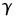를 소개한다.

이는 delayed effect에 해당하는 downweighting rewards를 이용함으로써 약간의 **bias를 가져오는 대신 variance를 줄일 수 있도록** 만들어준다.

이 파라미터는 discounted MDP에서의 discount factor와 동일하지만, 이 논문에서는 undiscounted MDP에서의 variance reduction parameter로서 사용된다.

 

아래는 parameter 가 적용된 discounted value function들과 그로부터 계산되는 gradient 식을 표현한 것이다.

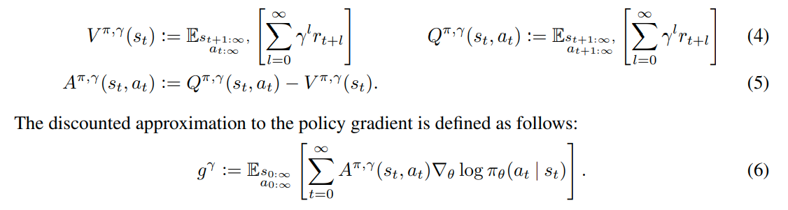

 

이어서 advantage function의 -just estimator라는 표현이 등장하는데, 

이는 위 gradient식에서 <u>discounted advantage function 역할</u>을 하되, 그리고 <u>bias가 없는</u> estimator를 의미한다.

-just estimator의 정의와 전제에 대해서는 논문에 상세히 나오니 참고하도록 하자.

 

그러한 특성을 만족할 수 있는 -just estimator는 다음과 같다.

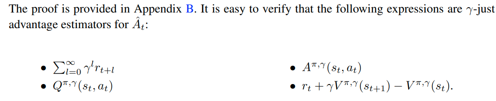

 

### [3. Advantage Function Estimation]

approximate value function을 **V**라 하자.

그리고 discount 를 지니는 V의 **TD-residual** 을 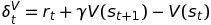 이라 하자.

이 때, 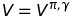를 만족하는 correct value function을 근사해낸다면, -just advantage estimator라고 할 수 있다.

그리고 사실 이것이 아래와 같이 unbiased advantage estimator 이다.

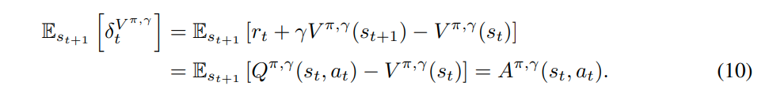

하지만 오직 를 만족하는 경우에만 -just하며, 그 외에는 bias를 지닌 policy gradient를 추정하게 된다.

 

TD error의 항들을 k번째까지 더한 것을 다음과 같이 표현하기로 하자.

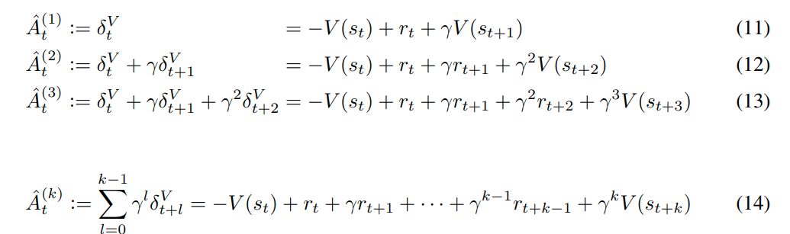

k-step까지의 모두 더한 식을 보면 returns의 k-step estimator에서 baseline V를 빼준 것과 같은 형태를 보인다.(이는 -just를 만족하는 조건과 같아보인다.)

1-step advantage estimator에서와 마찬가지로 k-step advantage estimator 역시 에서만 -just하다.

하지만 k-step을 무한대로 늘려준다면, bias가 상대적으로 작아지고(discount factor가 강하게 작용), minus baseline term이 bias에는 영향을 주지 않기 때문이다. 

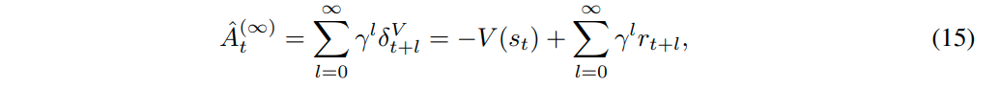

이를 정리하면 위 식과 같이 실험적으로 얻은 returns에서 value function baseline을 빼준 형태로 식이 도출된다.

 

이번에는 k-step estimator를 exponentially-weighted average를 적용해 **generalized advantage estimator GAE(, 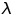)** 로 개념을 확장한다.

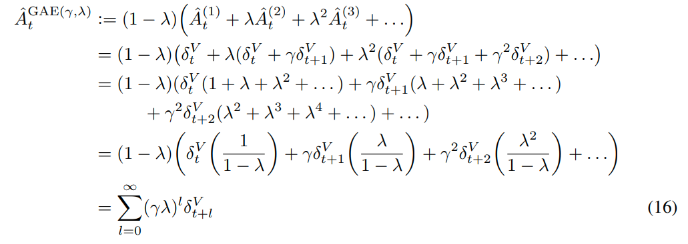

위와 같은 식 전개가 아주 당황스러울 수 있겠지만 **TD()** 개념을 이미 숙지하고 있다면, 유사한 형태임을 알 수 있다. [참고](https://daeson.tistory.com/334)

advantage estimator의 형태에 대해 generalized weight를 취해준 것이며 결과적으로 TD-residual에 parameter ,를 곱한 형태이다.

 

아래 식은 GAE의 항을 각각 0과 1로 특정해주었을 때의 특징들이다.

= 1일 때, estimator는 V의 정확성에 관계없이 -just하지만, high-variance하다.

= 0일 때, estimator가 일때만 -just하며, 일반적으로 매우적은 variance를 지닌다.

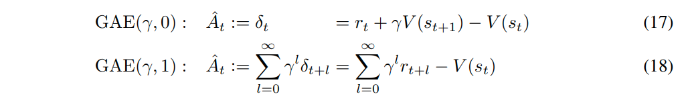

즉, GAE에서는 를 0~1사이로 조절하며 bias와 variance간의 타협점을 찾아낼 수 있을 것이다.

이와 같이 , 의 두 파라미터를 조절하며 **bias-variance tradeoff** 를 잘 찾아내는 것이 GAE의 중심 아이디어라고 할 수 있겠다.

### [4. Interpretation as Reward Shaping]

