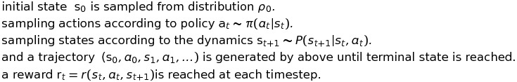
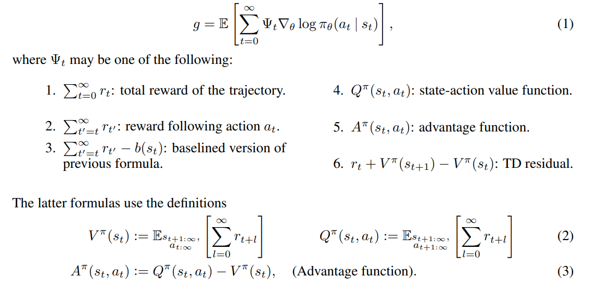

[HOME](../README.md)

### 6. GAE

[High-Dimensional Continuous Control Using Generalized Advantage Estimation]

John Schulman, Philipp Moritz, Sergey Levine, Michael I. Jordan and Pieter Abbeel(2016)

[paper_link](https://arxiv.org/pdf/1506.02438.pdf)

 

- 참고할만한 링크:
  - https://m.blog.naver.com/PostView.nhn?blogId=kwonpub&logNo=221298006981&proxyReferer=https:%2F%2Fwww.google.com%2F
  - https://daeson.tistory.com/334

### [Abstact]

policy gradient method은 RL에서 아주 매력적인 접근법이다.

그 이유는

1. neural network를 nonlinear function estimator로 바로 사용가능하며,

2. 누적 reward를 직접적으로 최적화 할 수 있도록 만들어준다.

 

하지만, 두가지 아주 중요한 challenges가 남아있는데,

1. 보통 아주 많은 수의 sample을 요구하며,(sample complexity가 높기 때문)
2. input data가 non-stationary하지 않는데 stable하고 steady한 improvement를 얻기가 너무 어렵다는 것이다.

 

이 논문에서는 첫번째 문제를 다루기 위해 policy gradient estimation의 variance를 줄여주는 value function을 사용한다.(약간의 bias를 가지게된다). 이 value funtion은 TD lambda와 유사한 advantage funtion의 exponentially-weighted estimator를 사용한다.

다음으로 두번째 문제를 해결하기 위해 policy와 value function의 업데이트를 위해 trust region optimization을 이용한다.

 

이러한 접근법을 통해 highly challenging 3D locomotion tasks에 대해 아주 좋은 결과들을 도출해 내었다.(learning gaits for bipedal, quadrupedal, learning standing up motion for biped)

지난 결과물들은 직접 policy가 나타내는 것을 직접 연결해줘야 했던것에 비해 이들은 fully-model-free 하다.

 

### [Introduction]

reinforcement learning에서의 목적은 policy의 expected total reward를 maximize하는 것이다.

위 문제를 푸는데 있어 가장 어려운 요소가 있다면, 어떤 action을 행했을 때 그것이 reward에 미치는 영향에 대해 long time delay가 존재한다는 것이다. 이것을 **credit assignment problem** 또는 distal reward problem이라 부른다.

value function은 이 문제에 대해 아주 멋진 solution을 내놓는데,  바로 delayed reward가 도달하기 전에 action의 좋은 정도를 추정하는 것이다.

 

parametized stochastic policy를 사용할 때, expected total returns의 gradient를 unbiased하게 추정하는것이 가능하다.(williams,1992; sutton et al.,1999)

유감스럽게도, 이는 시간에 따라 variance가 의도치않게 커지는 문제를 가지고 있었다. 과거의 action과 미래의 action이 미치는 영향이 혼재되어있기 때문이다.

actor-critic method라 불리는 방법은 empirical returns가 아닌 value funtion을 사용함으로써 약간의 bias를 가지지만 varience를 줄이는 데에 성공했다. (Konda&Tsitsiklis, 2003; Hafner&Riedmiller,2011)

하지만, sample의 수가 많아짐에 따라 high variance는 피할수 없는 문제였고, bias는 안좋은 영향을 미쳤다..(이 bias는 수렴하지 못하게하거나, 안좋은 방향으로 수렴하게 만들었다..)

 

이러한 문제를 해결하기 위한 또 하나의 policy gradient estimator를 제시하려고 하며, 이는  variance를 확실히 줄여주고, 용인 가능한 수준의 bias를 가지게 된다. 이를 **generalized advantage estimator(GAE)**라 부르기로 하자.

 

이 논문에서의 기여는 다음과 같이 요약될 수 있다.

1. Generalized Advantage Estimator(GAE)라는 이름의 policy gradients를 위한 효과적인 variance reduction scheme을 분석하여 이에 대한 타당함과 이해를 제공한다. 

2. value function을 위한 trust region optimization을 사용해 보다 robust하고 효과적인 방법으로 neural network으로 근사된 value function을 찾아낸다.
3. 위의 두가지 방법과 함께, 어려운 control tasks를 해결하기 위한 neural network policy를 효과적으로 학습할 수 있는 알고리즘을 얻었다.

### [Preliminaries]

policy optimization problem에서 undiscounted formulation에 대해 생각해보자.

위 문제의 목적식은 expected total reward를 최대화 하는것이다.

 

policy gradient methods는 gradients를 반복적으로 추정하여 expected total reward를 최대화할 수 있도록 해준다.

여기에는 policy gradient를 표현하는 여러가지 방법들이 있다.

위 다양한 표현 중에서 5번, advantage function을 선택하는 것은 확률적으로 가장 적은 variance를 안겨다준다.

이 advantage function은 알려진 값이 아니며 반드시 추정되어야만 하는 값이다.

그리고 advantage function은 그 정의에 따라, 해당 action이 policy의 일반행동보다 더 좋은지 나쁜지를 측정한다.