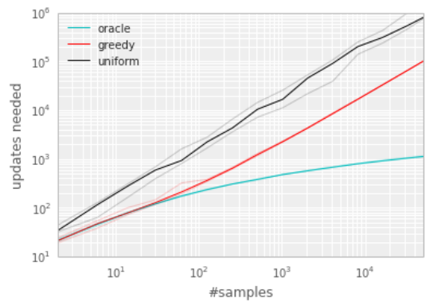
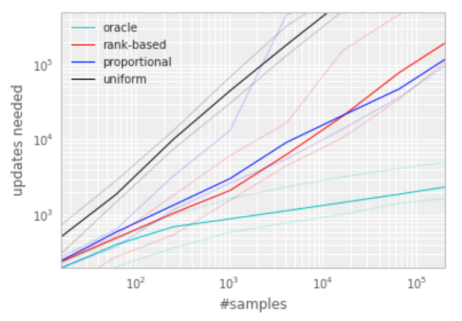
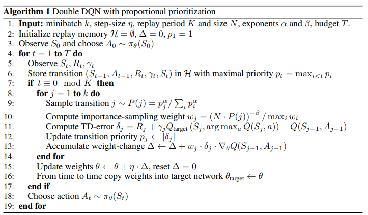

[HOME](../README.md)

### PER

[Prioritized Experience Replay]

Tom Schaul, John Quan, Ioannis Antonoglou and David Silver, Google DeepMind(2015)

[`PAPER`](https://arxiv.org/pdf/1511.05952.pdf) 

 

### [Scheme]

기존의 DQN 논문에서는 Experience Replay를 사용하여 **과거의 경험을 기억**해 학습에 재사용할 수 있게 만들었다.

이는 agent의 exploration문제와 sample efficiency를 매우 크게 높일 수 있게 되었다는 의의가 있다.

 

기존에는 저장했던 경험의 중요성과 상관없이 random하게 추출하여 재사용해 학습에 사용해왔다.

본 논문의 **핵심**은 아주 간단하게 설명하자면, **보다 중요한 경험을 자주 재사용하도록 만들자!** 라고 할수 있겠다.

구체적으로는 현재의 Q Network를 이용해 기존의 경험과의 *TD-error*를 구한 후, 이를 사용해 prioritized buffer로 만들어 구현한다.

 

이러한 방법을  **Prioritized Experience Replay(PER)** 라고 부르며 당시의 DQN보다 훨씬 좋은 성능을 자랑하는 SOTA로 자리매김 하였으며,

기존의 다른 model-free learning방식에 적용해 exploration 성능을 높이는데 매우 효과적으로 사용되고 있다.

 

### [Prioritized Replay]

#### (1) Prioritizing with TD-error

prioritized replay에서 가장 중요한 요소는 바로 **각 transition의 중요한 정도를 측정할 수 있는 평가지표**이다.

가장 이상적으로는 RL agent가 해당 transition으로 부터 얼마나 배울 수 있을 지에 대한 것이겠지만, 이는 쉽게 얻을 수 있는 지표는 아니다.

보다 현실적인 접근으로는 transition의 **magnitude of TD error**를 측정 하는 것이라고 할 수 있는데,

이는 해당 transition이 <u>얼마나 surprising 한지,  얼마나 예상 외의 것인지</u>를 의미한다.

 

TD error를 이용한 prioritized replay의 효과를 확인하기 위해 아래 그래프와 같이 *Blind Cliffwalk* 환경에서 

uniform과 oracle baseline, 그리고 '***greedy TD-error prioritization***' algorithm을 비교하였다.

 

이 알고리즘의 원리는 다음과 같다.

1. 매 transition을 따라 TD error를 계산해 replay memory에 저장한다. 

2. TD error의 크기가 가장 큰 transition은 memory로부터  replay된다.

3. 각 transition에는 q-learning update가 진행되며, 이는 TD error에 비례하도록 업데이트된다.

4. 알려진 TD error가 없는 new transition에 대해서는 maximal priority를 적용해 memory에 넣어준다.

   (모든 경험에 대해 적어도 1번 이상은 replay되도록 보장하기 위함이다)

 

#### (2) Stochastic Prioritization

그러나 *greedy TD-error prioritization*에는 몇가지 문제점이 존재한다.

1. TD에러가 replay된 transition에 대해서만 업데이트 된다.(모든 memory에 대해 계산하기에 computation이 크기때문)
   - 이로인해 **처음에 TD-error가 낮게 평가된 transition에 대해 다시는 방문할 기회가 없게된다**!
2. **noise에 취약**하다.(rewards 가 stochastic한 경우!)
3. greedy prioritization은 experience memory의 극히 일부분에 집중하도록 만든다.
   - 이는 **다양한 경험을 충분히 전달하지 못하며 over-fitting에 빠질수** 있도록 만든다.

 

이러한 이슈를 극복하기 위해 이 논문에서는 ***stochastic sampling method***를 제안한다.

 

#### (3) Annealing the Bias

 

#### (4) Algorithm(PER)

