[HOME](../README.md)

### PPO

[Proximal policy optimization algorithms]

John Schulman, Filip Wolski, Prafulla Dhariwal, Alec Radford, Oleg Klimov

[paper_link](https://arxiv.org/pdf/1707.06347.pdf) | [implementation](https://github.com/CUN-bjy/gym-ppo-keras)

 

### [Scheme]

TRPO에 이은 John Schulman의 새로운 Policy Optimization 알고리즘이며, Schulman은 꾸준히 자신이 세운 SOTA 기록들을 갱신하며 넘사벽의 존재가 되어버렸다.

PPO가 나온지 3년이 지난 2020년 현재. TD3, SAC 등 좋은 알고리즘들이 많이 등장했지만, 쉬운 구현과 상징성의 이유로 아직까지 제일 유명한 알고리즘으로서 꼽힌다.

 

기존의 [TRPO](./TRPO.md)는 기본적으로 복잡하다.(구현도 어렵고 이론적으로 쉽지 않다)

또한 noise를 포함하는 구조(dropout 등)나 파라미터를 공유(parameter sharing between policy and value function)가 가능한 구조와 호환되지 않는다.

해당 논문에서는 PPO(Proximal Policy Optimization)라는 알고리즘을 제안하는데,

first-order optimization만을 사용해 구현이 매우 쉬우며 **TRPO만큼의 성능**을 지니면서 **data efficiency문제와 위의 문제점들을 해결**하였다.

 

### [Background: Trust Region Methods]

TRPO 논문에서는 아래의 식과 같이 특정 constraint 이내에서 objective funtion("surrogate" objective)가 최대화 되는 policy로 update를 진행하며,

이를 **Trust Region Methods**라고 한다.

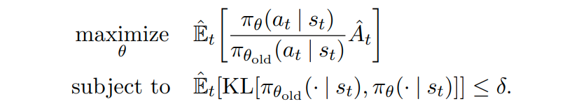

여기서 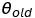가 update이전의 policy parameter vector인데, 

해당 문제는 <u>conjugate gradient algorithm</u>을 사용해 근사적으로(objective는 linear approximation, constraint는 quadratic approximation) 해결한다. 

(즉, 계산이 많고, 엄청 복잡하다. 이는 근사적으로 문제가 해결되었지만, 다른 연구자들이 개선하거나 분석하기에 최악일 수 있다..)

 

사실 Schulman은 처음 TRPO를 정의내릴 때 <u>특정 surrogate objective가 policy 의 성능을 보장하기 위한 lower bound를 형성한다</u>는 개념을 따라

constraint방법이 아니라 아래와 같이 **penalty 방법**(coefficient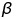를 지님)을 제시하였다.

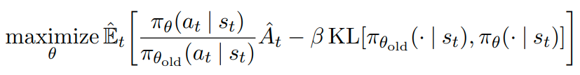

그럼에도 constraint 방법을 사용한 이유는 학습하는 도중에도 특성의 변화가 많아 고정된 를 결정하기 어렵기 때문이다.

 

따라서 이 논문의 목적인 **`TRPO와 같이 성능보장이 가능한 policy optimization을 first-order algoritm로 계산하자`**를 만족하려면,

고정된 coefficient 를 선택해야하는 것과 SGD를 이용한 penalized objective의 최적화하는것이 그렇게 만만하지 않다는 것이다. 

<u>추가적인 개선이 필요하다!</u>

 

### [Clipped Surrogate Objective]

probability ratio를 다음과 같이 정의해보자.

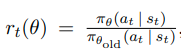

그리고 이를  기존의 "surrogate" objective함수에 적용하면 다음과 같이 표현해 볼 수 있을 것이다.

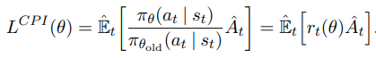

여기서 **CPI**는 conservative policy iteration의 약자이며 TRPO에서 언급된 바 있다.

constraint 없이 위 objective를 maximization하게되면 policy update이 큰 스텝으로 진행될 가능성이 있다. 이는 monotonuous improvement를 보장할 수 없다.

 

그럼 objective를 어떻게 수정해야할까? 바로, probability ratio를 숫자 1에서부터 멀리 떨어져있는(**기존 policy와 많이 다른) policy에 penalty를 주는 것**이다.

아래는 이 논문에서 제시한 새로운 surrogate objective funtion이다. 

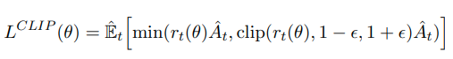

여기서 은 hyperparameter이다.(default:0.2)

위 식에서 첫번째 term은 기존의 objective이며, 두번째 term은 clipped probability ratio를 적용한 것이다.

결과적으로 이 둘을 비교해 더 작은값을 취함으로써 **lower bound**를 형성하는 데에 의미가 있다.

아래 도표를 참고한다면 직관적으로 이해에 도움을 줄 수 있을 것이다.

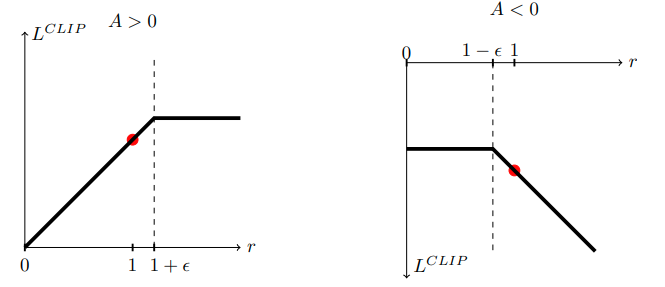

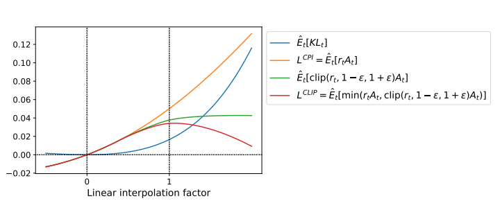

 

### [Adaptive KL Penalty Coefficient]

저자에 따르면 해당 내용은 이전 섹션에서 제안되었던 방법과 비교해 좋은 성능을 나타내지는 못하였지만 충분히 중요하기에 설명했다고 한다.

해당 섹션에서 다루는 내용은 기존의 penalty방법에서 를 adaptive하게 변화시켜주는 것이다.

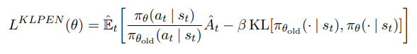

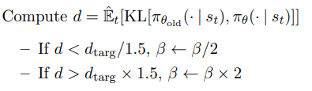

다만, 드물게 KL divergence와 d target이 현저하게 차이나는 경우가 존재한다고 한다. 

하지만 가 빠르게 조정이 되니 크게 문제가 되지 않는다고 하며, default 와 heuristic하게 정한 값들은 크게 sensitive하지 않다고 한다.

 

### [Proximal Policy Optimization]

이전 섹션들에서 언급되었던 surrogate loss function들은 일반적인 policy gradient방법에서 약간만 수정한다면 계산 가능하며 또 미분가능하다.

PPO에서는 policy와 value function의 parameter sharing이 되는 구조의 neural network architecture를 사용하는데,

이를 위해 loss function이 policy surrogate와 value function error와 관련된 term을 결합되어 설계된다.

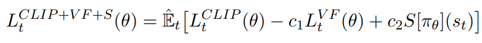

c1과 c2는 각각 loss의 비중을 결정하는 계수, L_VF는 value function의 squared-error loss, S는 entropy bous이다.

 

참고.

*TRPO를 읽을 때 이론에만 집중하느라 깨닫지 못했던 것인지, Value function에대해 따로 근사함수를 사용하지 않는다.*

*GAE에서는 value function에 대해 따로 trust region을 사용해 업데이트 해주는데, 당연히 TRPO도 그렇게 한다고 착각했던 것 같다.*

*이번 논문에서는 명확히 Policy와 value에 대한 output이 나오는 그런 parameter로 설계되도록 parameter를 공유한 듯 하다.*

 

아래는 recurrent neural network에 알맞게 사용되고있는 방법으로, T timestep만큼 미리 sample을 모아 업데이트 하는 방식이다.

length-T만큼의 trajectory segment를 sample로서 하나의 미니배치로 사용하는 것이다.

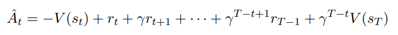

이 개념에 generalizaing을 더하면 truncated version of generialized advantage estimator로 재탄생 하게 된다.

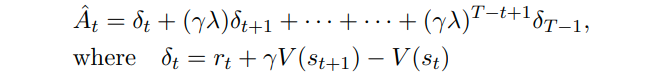

PPO는 아래와 같이, 매 iteration마다 N(parallel) actor가 T timestep만큼의 데이터를 모아 업데이트 하는 방식이다.

즉 NT 개의 데이터를 이용해 surrogate loss를 형성하고, minibatch SGD를 적용해 이를 업데이트한다. K epoch에 걸쳐 이를 반복한다.

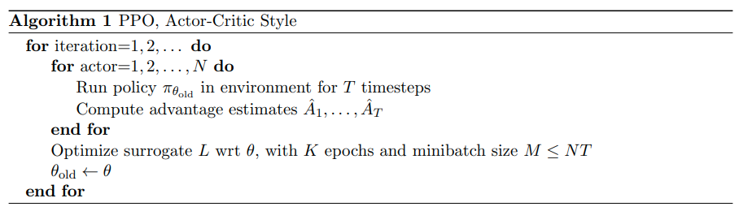

 

### [Experiments]

논문참조.