[HOME](../README.md)

###  Sutton_PG

[Policy gradient methods for reinforcement learning with function approximation]

Richard S. Sutton, David McAllester, Satinder Singh, Yishay Mansour,1994

[paper link](http://papers.nips.cc/paper/1713-policy-gradient-methods-for-reinforcement-learning-with-function-approximation.pdf)

 

#### [intro]

이 논문이 발표될 당시 RL의 주된 접근 방식은 '*value-function* approach'였다.

하지만, 이러한 방식에는 몇가지 **한계점**이 존재했는데,

**첫번째**는 optimal policy는 주로 확률적(stochastic)으로 몇가지 액션을 고르는 것인 경우가 많은데, deterministic policy를 찾는것에만 편향되어있다는 것이다.

**두번째**는 임의의 어떤 액션에 대한 보상기대값이 아주 근소한 차이만 나더라도, 해당 액션이 선택되고 안되고를 결정할 수 있다는 것이다. 이러한 불연속적인 차이는 'value-function approach'를 따르는 알고리즘의 수렴성을 입증하는데에 주요 문제점으로 꼽히고 있다. (**policy의 variance가 크다**)

 

이 논문은 이러한 문제점을 해결할 수 있는 대안적인 방법을 소개한다.

기존의 방식은 value function을 근사해 policy를 결정하는 반면, 독립적인 function approximator를 이용해 stochastic policy를 직접 근사한다.

가령, **input**: representation of states / **output**: action selection probabilities / **weights**: policy parameters

와 같은 형태의 neural network으로 표현하며,

 *policy gradient* approach를 이용해 다음과 같이 policy parameter를 퍼포먼스 방향으로의 gradient에 비례하도록 parameter를 업데이트 해준다면

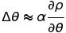

performance(reward)가 극대화 하는 지점에서 local optimal policy로 수렴하게 될 것이다.

이는 *value-function* approach와 다르게 **parameter의 작은 변화가 policy의 작은 변화로 연결된다!**

(value-based에서는  parameter가 value를 이루므로 value가 조금만 변해도 policy의 차이가 많이 나는 문제가 있었음) 

 

#### [main]

본론에서는 새로운 내용들 보다는 서문에서 다루었던 내용들의 수학적 증명으로 이어진다.

1. ##### **Policy Gradient Theorem**

   value function approximation을 하기위한 방법에는 두가지 방법이 있는데, 

   **average-reward formulation**과 **start-state formulation** 두가지 방법이 있다.

    

   ***Theorem 1 (Policy Gradient)***

   
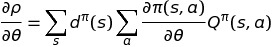

   이 수식은 결국 위 두 가지 approximation 방법 모두에 적용이 가능하며 appendix에 각 각 증명이 되어있다.

    

   
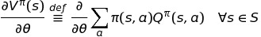

   기본적으로 두 증명 모두 위 식과 같이 value function과 action-value function의 기본 정의로부터 유도된다. 

   유도하는 방식은 Q-function을 어떤 방정식으로 구해내느냐에 따라 달라지니 appendix를 유심히 살펴보시길 바란다. 

   결국 Theorem 1이 의미하는 바는 논문에도 잘 설명되어있듯이, **distribution of states가 policy changes에 어떤 영향도 주지 않는다는 것이다.** 

   이는 특성은 **sampling을 통해 gradient를 근사하기에 편리**하게 작용하는데,

   아래 수식과 같이 unbiased-estimator를 구해 근사할 수 있을 것이다.

   
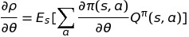

   또, 위 식에서 Q-function의 경우 계산값을 도출하기 어려워, 해당 policy를 따라 수집된 Reward를 이용해 근사되어야 할 것이다.

     

2. **Policy Gradient with Approximation**

   Q-function이 학습된 fucntion-approximator에 의해 잘 근사되었다고 가정하자.

   만약 정말로 근사가 잘 되었다면 위 식(**Theorem 1**)에서 Q-function을 대체해 사용하고 싶을 것이다.

   근사함수 f에 대해 그의 파라미터 w가 동일한 policy를 따라 학습되고 업데이트 된다면 다음과 같은 식이 성립된다.
   
   
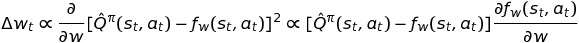

   
   만일 근사함수 f가 충분히 만족스러운 성능을 낼 때, local optimum에 수렴할 것이고 그땐 아래와 같은 수식 역시 성립된다.
   
   
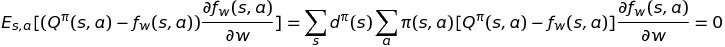

   
   ​	위 식에 대한 설명을 하자면,	

   ​	(1) local optimum이 만족된다면 당연히 파라미터 w의 변화량이 0에 수렴할 것이며,

   ​		(approximation-fuction과 Q-function의 차이가 매우 근소하므로 더이상 학습하지 않는다)

   ​	(2) 이를 Expectation 값으로 표현해주기 위해서 모든 state와 action을 고려해 앞의 distribution of states와 policy에 대한 항을 붙여준 것이다.

    

   ***Theorem 2 (Policy Gradient with Function Approximation)***
   
   
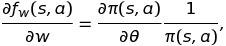

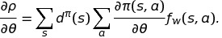

   논문에서는 위 Theorem 2의 첫번째 수식을 이용해 아래 수식을 쉽게 증명해낸다.

개인적으로 첫번째 수식의 등장은 조금은 뜬금없이 느껴졌는데, 해당 [link](https://bit.ly/2VnABnC) 를 보고나서야 어느정도 납득이 되었다.

첫 수식에 대해서는 **(Semi-compatible approximation)** 에대해 정의 되어있어야 한다.

그의 정의는 다음과 같다.

​	(1) Q-function을 두개의 파라미터 벡터 w,xi 로 이루어진 근사함수로 만들어보자.

​		해당 근사함수는 state-action value와 해당 state 자체에 대한 value function으로 나눌 수 있을 것이다.

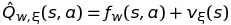

   ​	(2) 이때, state-action을 의미하는 근사함수 f가 policy parameterization과 호환될 수 있다면 그 근사는 semi-compatible하다고 한다.(??)

   ​		여기서 의미하는 compatible함을 전제하는 조건은 다음 식을 만족해야하며, 결국 이렇다는 가정 하에 Theorem은 성공적으로 증명되는 것이다.
   
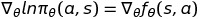

   ​		논문에 주석으로 달려있는것을 보니 아마도 저런 가정을 막 해버려도 해당 이론이 정당함을 Tsitsiklis라는 사람이 증명한듯 하다.

   ​		(위 식은 자연스레 Theorem 2의 첫번째 수식으로 간단히 귀결된다.)

​     

   결론적으로 Theorem 2을 통해 저자가 전달하고자 하는 것은 근사함수 f가 Q-function를 충분히 근사할 수 있다면,

   **Q-function을 쓰지않고 Approximation-function만으로 Policy Gradient를 구해낼 수 있다**라는 것이다.

    

3. **Application to Deriving Algorithm and Advantages**

   특정 policy parameterization에 대해, Theorem 2는 value-function parameterization을 적절한 형태로 유도할 수 있도록 만들어 줄것이다.

   예를 들어 policy를 다음과 같이 Gibbs distribution(softmax)의 형태로 이루어져있다고 가정해보자.

   
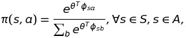

   여기서 phi(s,a)는 state-action pair를 나타내는 일종의 feature(trajectory) vector이며

   Theorem 2에서 사용했던 개념(semi-compatible approximation)을 이용해 

   아래와 같은 수식을 도출해낼 수 있다.

   
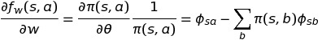

   위 식을 적분한다면 근사함수 f는 아래와 같이 구해진다.

   
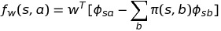

   해당 예시를 들어 설명하고자 하는 내용은 다음과 같다.

   (1) 모든 states에 대해 zero-mean의 형태로 정규화되어있는 경우가 아니라면, 근사함수 f는 policy와 동일한 features(trajectories)에 대해  linear해야한다.

   (2) 반대로 생각해보자. **근사함수 f가 모든 states에 대해 zero-mean을 가진다면**, 

   ​	non-linear한 policy parameterization을 가지는 policy에 대해서도 **compatibility condition을 만족**할 것이다.

    

   위 내용은 이 논문에서 설명하고자 하난 policy convergence를 설명하기위한 필요조건으로서, 

   value-function의 **근사함수 f가 절대값(absolute value)이 아닌** 각 state에서의 action이 지니는 **상대적인 값(relative value)**을 지니며, 

   이는 **상태간의 variation이 존재하지않도록** 근사하는것을 의미한다.

    

   이는 advantage function을 나타내는 다음 식과 같이 유추될 수 있으며,

   semi-compatible approximation을 위해 Q-function을 새로이 가정했던 내용과 같은 맥락으로 귀추된다.
   
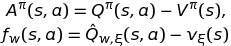

   따라서, 근사함수 f를 advantage function과 같이 생각해도 좋다는 결론이 나온다.

    

   하지만 위 식은 policy가 softmax의 형태와 같을 경우 근사함수 f가 advantage function과 같은 특성을 지닌다는 의미이며,

   해당 식을 조금 더 일반화 하자면 다음과 같이 정의될 수 있다.
   
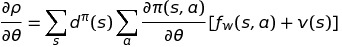

   상태에 대한 **임의의 함수 v를 추가**하여 value function을 근사하는 함수 전체를 **advantages의 형태로 만들어 일반화** 한 것이다.

   임의의 함수 v(s)는 근사함수 f를 도와 variance를 줄이는 방향으로 정의 되어야 할 것이며 이는 rl의 baseline연구의 그것들과 유사하다.

   일반적으로 baseline으로서 임의의 함수 v는 가치함수 V를 일반적으로 사용하며,

   해당함수는  policy와 근사함수 f의 업데이트에 영향을 주지 않음이 밝혀졌다고한다.

    

4. **Convergence of Policy Iteration with Function Approximation**

   Theorem 2에서 제시한 바와 같이, 이 논문에서는 최초로

   function approximation과 결합된 policy iteration의 형태가 locally optimal한 policy로 수렴함을 증명해냈다.

    

   **Theorem 3 (Policy Iteration with Function Approximation)**

   ​	policy와 근사함수 f가 각각

   ​	(1) compatibility condition을 만족하고

   ​	(2) 아래 부등식을 만족하는 미분가능한 어떤 function approximator이며
   
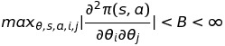

   
   ​	(3) 아래와 같은 방법으로 각 parameter(w,theta)를 업데이트 한다면, 
   
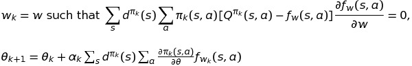

   
    
   
   ​	Policy Gradient가 0으로 수렴할 것이며, 이는 **policy가 local optimum로 수렴되어 최적의 정책을 구할 수 있음**을 의미한다.
   
   

