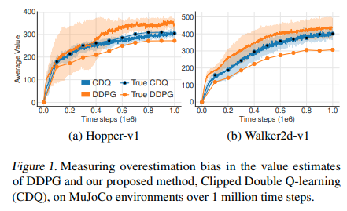
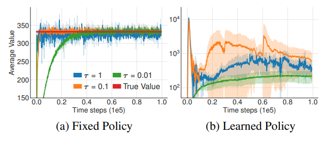
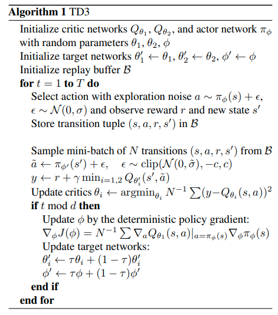
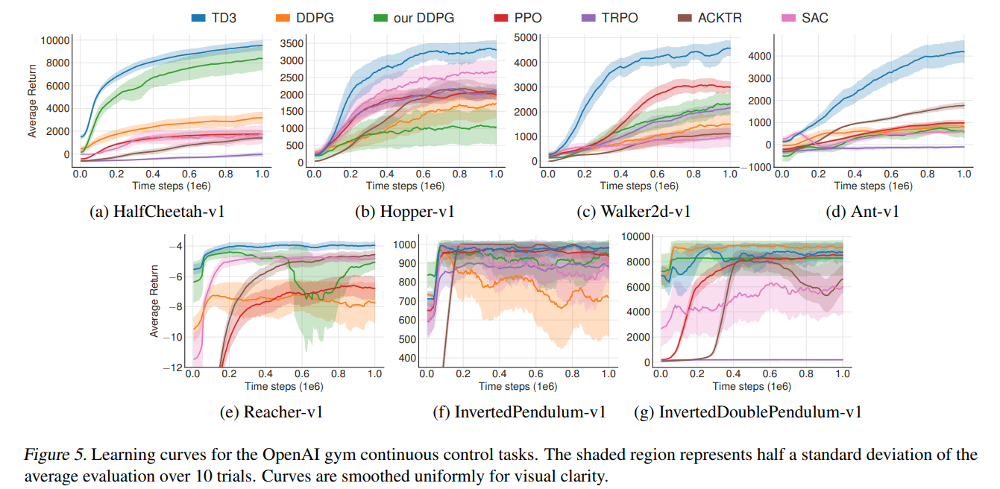

[HOME](../README.md)

### TD3

[Addressing Function Approximation Error in Actor-Critic Methods]

Scott Fujimoto , Herke van Hoof , David Meger (2018)

[`PAPER`](https://arxiv.org/pdf/1802.09477.pdf)   |	[`CODE`](https://github.com/CUN-bjy/gym-td3-keras)

 

### [Scheme]

- John Schuleman의  TRPO, PPO 이후 policy gradient에서 가장 주목받고 있는 알고리즘들 중 하나인 TD3.
- 기존 DeepMind에서 발표한 DDPG와 거의 같은 형태를 가지고 있기 때문에 이론적 배경이나 구현과정이 쉬운 편이며 여느 actor-critic에도 적용 가능하다.
- 해당 논문에서 해결하고자하는 문제는 크게 두가지이며, 그에 대한 해결책을 제시해 기존의 SOTA를 능가하는 성능을 지녔음을 보인다.
  1. Overestimation bias -> solution : **Clipped Double Q-network and Update**
  2. Accomulation error from TD update. -> solution : **Delayed Policy update** & **Target Policy Smoothing**

 

### [Abstact]

- DQN과 같은 value-based 방식의 강화학습 방법에서는 function approximation의 오차가 **value가 overestimated되도록 추정**하도록 만드는 주된 이유이며, 이는 suboptimal policy로 빠지도록 만든다.

- 이러한 현상은 actor-critic 방식에서도 마찬가지임을 이 논문에서 보이며, value-based 방식에서의 위와 같은 문제를 효과적으로 해결한 Double Q-learning의 이론을 기반으로 새로운 메커니즘을 제안한다.

  :arrow_right:*Clipped Double Q-network*

- 또한 이 논문에서는 target network와 overestimation bias의 연관성을 보이고 policy update를 지연시킴으로서 update 당 에러를 줄여 성능을 보다 향상시킨다.

  :arrow_right:Delayed Policy update

- 위 알고리즘은 OpenAI gym task를 통해 검증하였으며 기존의 SOTA보다 좋은 성능을 나타낸다.

 

(Section 1,2는 생략합니다.)

### [3. Background]

기본적인 강화학습의 환경은 아래와 같이 표현된다.
$$
t : \text{at discrete time step}
\\s \in S : \text{with given state}
\\a \in A: \text{the agent selects actions}
\\ \pi : S \to A \text{, with respect to its policy}
\\r : \text{receiving a reward, } s' : \text{and the new state}
$$

$$
R_t = \sum^T_{i=t}\gamma^{i-t}r(s_i,a_i) : \text{discounted sum of rewards(return)}
$$

강화학습에서의 **목표**는 반환값의 기대치를 최대화 해줄 수 있는 최적의 policy $\pi_\phi$(즉 이를 구성하는 파라미터 $\phi$)를 구하는 것이며, 이러한 parameterized policy는 **반환값의 기대치의 기울기값을 통해 업데이트** 해준다.
$$
\text{expected return : } J(\phi) = \mathbb{E}_{s_i\sim p_\pi,a_i\sim\pi}[R_0]
\\\text{its gradient : } \nabla_\phi J(\phi) = \mathbb{E}_{s\sim p_\pi}[\nabla_aQ^\pi(s,a)|_{a=\pi(s)}\nabla_\phi\pi_\phi(s)].
$$
그리고 반환값의 기대치는 일반적으로 critic 또는 value function이라 불리는 Q-value를 계산해 구한다.
$$
Q^\pi(s,a) = \mathbb{E}_{s_i\sim p_\pi,a_i\sim\pi}[R_t|s,a] :\text{as definition}
\\ Q^\pi(s,a) = r + \gamma\mathbb{E}_{s',a'}[Q^\pi(s',a')], \space a'\sim\pi(s') : \text{bellman form}
$$
large state space에 대해 Q value를 근사하기 위해 parameter $\theta$를 사용하며, objective $y$에 대해 업데이트 수식은 다음과 같다.
$$
y = r + \gamma Q_{\theta'}(s',a'), \space a'\sim\pi_{\phi'}(s')
$$
여기서 $\theta'$와 $\phi'$는 각각 target network에 해당되며 업데이트의 안정성을 위해 존재하며 현재의 actor, critic으로부터 각각 soft update받게된다(DDPG참고)
$$
\text{soft update : } \theta' \gets \tau\theta + (1-\tau)\theta'
$$

 

### [4. Overestimation Bias]

discrete action을 사용하는 Q-learning에서는 가치추정단계에서 다음과 같은 greedy target을 사용한다.
$$
y = r + \gamma max_{a'}Q(s',a')
$$
하지만, 이러한 방식은 target이 error $\epsilon$에 취약한 경우 error를 가지는 value의 maximum값이 일반적으로 true maximum보다 크다는 것이 입증되었다. *(Thrun & Schwatz, 1993)*
$$
\mathbb{E}_\epsilon[max_{a'}(Q(s',a')+\epsilon)] \ge max_{a'}Q(s',a')
$$
즉, 이러한 결과는 **지속적인 overestimation bias**를 만들게 되며 이러한 문제는 function approximation을 이용하게 되었을 때 피할 수 없는 문제이다.

 

위와 같은 문제가 자명히 밝혀진 반면에, **actor-critic방식에서도 overestimation bias 효과가 발생하는지**에 대한 연구가 없었으며 이 논문에서 밝히고자 한다는 것이 해당 section의 요지이다.

 

#### 4.1 Overestimation Bias in Actor-Critic

먼저, 해당 section에서는 <u>deterministic policy gradient</u>를 사용해 policy를 업데이트한다는 가정 하에 overestimation이 발생한다는 것을 증명하려한다는 것을 알린다.

주어진 policy parameter $\phi$에 대해 function approximation을 사용해 update를 진행한 policy $\phi_{\text{approx}}$와 optimal policy $\pi$의 true value function을 사용해 update를 진행한 $\phi__{\text{true}}$가 아래와 같이 존재한다고 가정하자.
$$
\phi_{\text{approx}} = \phi + \frac{\alpha}{Z_1}\mathbb{E}_{s\sim p_\pi}[\nabla_\phi\pi_\phi(s)\nabla_aQ_\theta(s,a)|_{a=\pi_\phi(s)}]
\\\phi_{\text{true}} = \phi + \frac{\alpha}{Z_2}\mathbb{E}_{s\sim p_\pi}[\nabla_\phi\pi_\phi(s)\nabla_aQ^\pi(s,a)|_{a=\pi_\phi(s)}].
$$
그리고 위 parameter를 사용하고있는 policy를 각각 $\pi_{\text{approx}}, \pi_{\text{true}}$라 할 때 다음이 성립한다.

1. 충분히 작은 error $\epsilon_1$이 존재($\alpha\ge\epsilon_1$)한다고 할 때, $\pi_\text{approx}$의 approximate value는 $\pi_\text{true}$의 approximate value보다 작거나 같다.
   $$
   \mathbb{E}[Q_\theta(s,\pi_{\text{approx}}(s))] \ge \mathbb{E}[Q_\theta(s,\pi_{\text{true}}(s))]
   $$
   
2. 마찬가지로 충분히 작은 error $\epsilon_2$이 존재($\alpha\ge\epsilon_2$)한다고 할 때, $\pi_\text{true}$의 true value는 $\pi_\text{approx}$의 true value보다 작거나 같다.
   $$
   \mathbb{E}[Q^\pi(s,\pi_{\text{true}}(s))] \ge \mathbb{E}[Q^\pi(s,\pi_{\text{approx}}(s))]
   $$

3. 마지막으로 $\mathbb{E}[Q_\theta(s,\pi_{\text{true}}(s))] \ge \mathbb{E}[Q^\pi(s,\pi_{\text{true}}(s))]$이 성립한다면, 위 두식에 의해 $\alpha < min(\epsilon_1,\epsilon_2)일 때 value estimation 값은 overestimated될 것이다.
   $$
   \mathbb{E}[Q_\theta(s,\pi_{\text{approx}}(s))] \ge \mathbb{E}[Q^\pi(s,\pi_{\text{approx}}(s))]
   $$

 

수식으로 어렵게 씌여져있지만, 결국 전달하고자하는 바는 **function approximation을 이용한 actor-critic역시 true Q-value에 비해 overestimation됨**을 증명하고자 한 것이다.

 

이러한 overestimation은 다음과 같은 두가지 문제를 야기한다.

1. 초기에 작은 overestimation bias였지만 **지속적인 업데이트에 의해 bias가 심각하게 커질 수 있다**.
2. **부정확한 value estimation이 poor policy업데이트를 초래**하며 suboptimal policy나 형편없는 policy를 만든다.

 

**참고.**

이론적인 overestimation의 증명이 과연 실제 SOTA 알고리즘에서도 일어날까? :arrow_right:  **yes**

(해당 논문에서는 아래 도표와 같이 실험을 통해 증명하였다.)

 

#### 4.2 Clipped Double Q-Learning for Actor-Critic

위에서 보인 overestimation bias를 줄이기 위한 다양한 접근방법들이 그동안 제기되어왔지만, actor-critic에서는 대부분 효과적이지 않았다고 한다. 해당 논문에서는 **Double Q-learning에서 제시하였던 일부 이론을 응용해 novel clipped variant를 actor-critic 환경에서 적용가능**함을 보인다.

 

Double Q-learning에서는 서로 다른 **두 value estimator를 이용**해 value function이 편향되지 않도록 만들어주는데, 두 value estimator가 독립적이라면 반대측 estimator로부터 선택된 action이 unbiased estimation임을 이용할 수 있기 때문이다.

마찬가지로 Double DQN에서는 target network를 사용하는 것을 제안하였고 target network가 아닌 current value network를 이용해 greedy maximization을 이용해 policy를 얻도록 하였고, actor-critic 셋팅에서는 비슷하게 target policy를 이용해 learning target을 생성할 수 있도록 만들어주었다.

 

하지만 실제로는 actor-critic에서 <u>너무도 천천히 변화하는 policy에 대해</u>서는 **current policy와 target policy의 network가 너무 유사해 독립적인 estimator로서 만들어지기 힘들며** overestimation의 개선이 미미하다는 것을 발견하였다.

그 대신에 기존의 Double Q-learning에서의 방식이 아닌 actor($\pi_{\phi_1}, $\pi_{\phi_2}$)와 critic($Q_{\theta_1}, $Q_{\theta_2}$)에 대해 짝을 만들어 서로의 estimator를 이용해 업데이트하는 방법 역시 고려해 볼 수 있다.
$$
y_1 = r + \gamma Q_{\theta'_2}(s',\pi_{\phi_1}(s))\\
y_2 = r + \gamma Q_{\theta'_1}(s',\pi_{\phi_2}(s))
$$
자세한 설명을 위해 풀어 설명하자면,

1. 두 critic network의 target을 서로 독립적인 target critic network로 정해 critic update를 진행한다.
2. 학습된 두 critic network는 해당하는 policy를 업데이트 해준다.

 

위와 같은 방식을 이용한다면 policy update에 의한 bias는 피할 수 있을 것이다.

**하지만, 두 critics는 완전히 independent하지 않다!**

그 이유는 같은 replay buffer를 사용하여 서로 다른 critic을 학습하기위해 사용했을 뿐이기 때문이다.

 

결과적으로 특정 states들에 대해 $Q_{\theta_2}(s,\pi_{\phi_1}(s)) > Q_{\theta_1}(s,\pi_{\phi_1}(s))$를 만족하게 될 것이며, true value보다 $Q_{\theta_1}$의 값이 overestimate될 수도, 그리고 특정 부분에서는 훨씬 심할수도 있다는 것이다.

이러한 문제를 해결하기 위하여 이 논문에서는 **덜 biased 된 $Q_{\theta_2}$를 biased된 $Q_{\theta_1}$로 upper-bound 제한 하는 방법을 제시한다.** 말로 표현하려니 약간 난해할 수 있지만, 간단히 식으로 다음과 같이 나타낼 수 있다.
$$
y_1 = r + \gamma \text{min}_{i=1,2}Q_{\theta'_i}(s',\pi_{\phi_1}(s'))
$$
 즉, 두 추정값의 minimum값을 target으로 이용해 업데이트(*Clipped Double Q-learning algorithm*)하고자 하는 것이다. 

 

저자는 Clipped Double Q-learning을 이용하였을 때 어떠한 **추가적인 overestimation도 발생하지 않았다**고 하며, **비록 underestimation bias가 발생할 수는 있지만 overestimation bias보다 훨씬 낫다**고 이야기한다.

> 개인적으로 해당 논문을 보고 td3를 구현해보았을 때 확실히 value의 estimate 값 자체가 매우 낮게 나타났지만, 낮은 target error덕인지 훈련속도가 현저히 느려지는 것을 체감하였으며 결국 시간이 지나자 td error역시 매우 높아지기 시작했다.. overestimation bias에 대한 효과는 느껴지지만 이것이 학습 자체에 어떤 효과를 주는지에 대한 것은 사실 와닿지 않는 것 같다. 오히려 그냥 DDPG가 더 학습이 잘되는 느낌? 아직 td3를 구현중이어서 그런것일수도있다 ㅜㅜ(테스트하면서 적은 [analysis log](https://github.com/CUN-bjy/gym-td3-keras/issues/10) 참고)

두번째로 function approximation error에 대한 개선덕분에 **high value임에도 lower variance estimation error를 가질 수 있게 되었다**고 이야기한다. 

 

### [5. Addressing Variance]

Overestimation bias뿐만아니라 high variance의 value estimation은 policy update를 진행할 때에 noisy한 gradient를 제공한다. Section 4에서도 언급하였듯이 overestimation bias가 variance의 개선에 기여하고있지만, 해당 Section에서는 직접적으로 **variance 자체를 다룰 수 있는 방법**들에 대해 이야기한다.

 

기존 Sutton & Barto의 논문에서 밝혀졌듯이 learning speed를 줄이는 것은  variance를 줄일수는 있지만 실제로 performance에 영향을 줄 수 있다. 해당 논문에서는 **estimation error 최소화의 중요성**을 다시금 강조하고, **target network와 estimation error를 연관지어 variance를 줄일 수 있는 개선된 actor-critic 학습 과정을 제시**하려한다.

 

#### 5.1 Accumulating Error

temporal difference update를 이용하는 모든 estimator는 value를 estimation하는 과정에서 error를 동반한다. 매 업데이트마다는 **아주 작은 error일지라도 이러한 estimation error는 쌓일 수 있기 때문에 잠재적인 거대한 overestimation bias와 이로 인한 suboptimal policy update를 유도**할 수 있다.

이는 function approximation 셋팅에서 훨씬 심각하게 발생하며 이러한 환경에서는 절대로 bellman equation을 만족할 수 없다.(매 업데이트마다  일정량 이상의 TD-residual이 발생하기 때문)
$$
Q_\theta(s,a) = r + \gamma\mathbb{E}[Q_\theta(s',a')] - \delta(s,a)
$$
 

해당 문제는 아래와 같이 expected return의 estimation을 학습한다는 개념을 expected return에서 미래의 td-error의 expected discounted sum을 뺀 값이라고 형태변환 할 수 있다. 즉, 쉽게 설명하자면 **단순히 estimation과정에서의 에러가 아닌 미래에 얻을 reward자체에 대한 error로 보자**는 것이다. 이에 따르면 estimation의 variance는 미래에 얻을 reward(performance)의 variance와 estimation error에 비례함을 의미한다. 

:arrow_right: estimation variance를 잡아야 하는 이유? 를 강조하기 위한 내용으로 추측된다.
$$
Q_\theta(s_t,a_t) = r_t + \gamma\mathbb{E}[Q_\theta(s_{t+1},a_{t+1})] - \delta_t
\\ = r_t + \gamma\mathbb{E}[r_{t+1} + \gamma\mathbb{E}[Q_\theta(s_{t+2},a_{t+2})] - \delta_{t+1}] - \delta_{t}
\\=\mathbb{E}_{s_i\sim p_\pi,a_i\sim\pi}[\sum^T_{i=t}\gamma^{i-t}(r_i-\delta_i)].
$$
 

#### 5.2 Target Networks and Delayed Policy Updates

이번에는 <u>target network와 function approximation의 관계</u>에 대해 파헤쳐보고, 이를 통해 **stable target이 error의 증식을 막아주는 역할**을 할 것임을 보이고자 한다.

 

target network는 deep learning에서 잘 알려진 stability tool이다. 보다 안정적인 objective를 제공함으로서  수많은 데이터의 수렴을 원활히 돕는 역할을 해준다.

즉, **학습의 안정성을 부여해 variance를 확실히 낮추는 역할**을 하는 핵심적인 구조이다.

(저자는 적절한 target update 비율을 가진 target network의 중요성을 논문에서 실험을 통해 재차 강조하고있다.)

 

<u>그렇다면 actor-critic method에서 학습을 실패하게하는 요소</u>는 무엇일까?

관찰결과, target network가 없는 상황에서 자주 발생하는 **divergence 문제**는 <u>high variance의 value estimation을 통한 policy update에서 발생</u>한다. 조금 풀어서 말하자면, **value function의 발산은 policy가 poor할 때 overestimation을 통해 발생하며, 반대로 value estimation의 부정확함이 policy를 poor하게 만든다**.

 

조금 말장난같고 당연한 이야기를 하는 듯 하지만, 저자가 강조하고싶은 부분은 바로 이것이다.

> policy network를 value network보다 조금 덜 자주 업데이트해야되는거 아니야?

**먼저 estimation error를 최소화 한 다음에 policy update를 진행하자.**

이에 따라 저자는 **delayed policy update**를 제안한다. 변하지 않는 critic에 대해 반복할 가능성을 최대한 줄이기 위해 policy update를 충분히 늦추자는 것이다.

이러한 알고리즘의 효율성에 대한 증명은 실험 파트에서 보인다.

 

#### 5.3 Target Policy Smoothing Regularization

deterministic policy에 대한 걱정 중 하나는 바로 **value estimation에 대해 특정 값들에 overfit되는 문제**가 발생하지 않을 지에 대한 문제이다. stochastic policy와는 달리 deterministic policy에서의 action은 특정 state에 대해 발동할 action이 정해져있기 때문에(deterministic하다), memory buffer에 저장되어있는 state, action pair에 의해서만 critic network가 학습할 수 있으며 buffer에 없는 pair에 대한 경우의 수는 학습할 수 없게 된다.

 

해당 논문에서는 **target policy smoothing이라는 regularization 전략을 사용**해 위와 같은 문제를 해결할 수 있음을 제시한다.

즉, target action의 주변에 비슷한 value estimate를 형성하도록 model을 fitting시켜주면 variance를 제거해줄 수 있다.

> (부가설명) deep neural network를 이용한 function approximator의 경우 복잡한 모델인 탓에 특정 값에 대해 overfitting에 취약할 수 있다.
>
> 유사한 state와 action에 대해서 Q값의 variance가 생길 수 있는데, (e.g) Q(1.0,1.0) = 1, Q(1.0,1.1) = 3가 아닌 Q(1.0,1.1) = 1.01이 되도록 
>
> deterministic policy에 대한 smoothing을 통해 variance를 잡을 수 있다.

$$
y = r + \mathbb{E}_{\epsilon}[Q_{\theta'}(s',\pi_{\phi'}(s')+\epsilon)]
$$

그럼 target policy를 smoothing하려면 어떻게 하면 좋을까?

바로 **target value를 구하기 직전의 next action에 random noise를 더해 input을 smoothing하는 방법**으로 다음과 같이 구현 가능하다.
$$
y = r + \gamma Q_{\theta'}(s',\pi_{\phi'}(s')+\epsilon),\\
\epsilon \sim \text{clip}(\mathcal{N}(0,\sigma),-c,c)
$$
 

### [6. Experiments]

해당 논문에서는 **Twin Delayed Deep Deterministic policy gradient algorithm(TD3)**를 제안하였으며 Deep Deterministic Policy Gradient algorithm(DDPG)를 기반으로 4.2(**Clipped Double Q learning**), 5.2(**Delayed Policy Update**), 5.3(**Target Policy Smoothing**)개념을 적용해 <u>function approximation error와 관련하여 안정성과 성능의 향상</u>시켜주었다.

 

TD3는 한 쌍의 critics와 하나의 actor로 구성되어있다.

1. 매 스탭마다 target policy에 의해 선택된 action의 **minimum target value을 이용해 한 쌍의 critics를 업데이트** 시켜준다.

   (여기서 target policy smoothing을 위해 target policy에 $\sigma$만큼의 노이즈를 첨가해준다.)

$$
y = r + \gamma \text{min}_{i=1,2}Q_{\theta_i'}(s',\pi_{\phi'}(s')+\epsilon)
\\ \epsilon \sim \text{clip}(\mathcal{N}(0,\sigma),-c,c)
$$

2. 그리고 **매 d step**마다 $Q_{\theta_1}$을 이용해 **policy 업데이트**를 진행한다.

---

아래 간단한 pseudo코드는 TD3의 모든 내용을 짧은 삽화에 담아내었다. 이 논문 전체의 내용이 아래 삽화에서 어떤 방식으로 표현되어있는지 찾아낼 수 있다면 TD3를 이해했다고 생각해도 무방하다. 아직도 잘 모르겠다면 반대로 아래 삽화를 통해서 내용을 추적해나가는게 효과적인 공부가 될 것 같다.

 

#### Evaluation

> TD3논문 내에 실험내용에 대한 아주 상세한 설명이 담겨있어 자세히 나열해보려한다. 논문에 중요히 언급하지 않은 중요한 스킬들이 담겨있다.
>
> (사실 open source로 공개되어있어 직접 코드확인이 가능하다. https://github.com/sfujim/TD3)

**1. 실험 환경**

- 실험환경은 MuJoCo continuous control tasks를 사용하였으며, OpenAI Gym framework를 사용하였다.

**2. 네트워크 구조 및 하이퍼파라미터**

- 각 actor와 critic에 대해 **400,300**의 hidden layer를 사용하였으며 **ReLU**를 activation layer로 사용
- Original DDPG와 다르게 critic의 first layer의 **input으로서 state와 action 모두**를 받도록 하였다.
- **Adam** optimizer를 이용해 actor와 critic을 업데이트 하였으며 learning rate 는 각 **10-3**이다.
- 매 **스텝이 끝난 후 100-transition 만큼**을 replay buffer로 부터 random sample로 꺼내 훈련시킨다.
- actor와 critic 모두 **tau=0.005** 의 비율로 target update를 진행한다.

**3. TD3에서 추가된 점**

- target policy smoothing은 **std 0.2**만큼의 normal random noise를 action에 섞어 보내준다. 단, **-0.5, 0.5 clip**된 noise이다.

- **매 d 스텝**마다 actor와 target critic network를 업데이트 시킨다. **critic은 매 스텝** 업데이트 시킨다.

  (d=2로 실험하였다. d 값이 더욱 클 때에는 error의 적체에 대한 이점이 더욱 많다. 당연히 d 값이 너무커 actor의 업데이트를 너무 안하면 문제가 생길것이다.)

**4. Exploration**

- 초기 initial parameter에 의한 의존성을 줄이기 위해 **초기 10000step정도의 pure exploratory policy**를 진행한다.
- 초기의 pure exploration이후에는 training시 **매 action에 std 0.1의 gaussian noise**를 더하는 **off-policy exploration 전략**을 사용한다.
  - DDPG논문에서 사용하였던 OU process는 일반적인 노이즈와 비교해 별다른 이점이 없었다고 함.

**5. 평가방법**

- 각 task에 대해 총 10+6step을 진행하며, 매 5000step마다 evaluation을 진행한다.
  - exploration noise없이 10회 이상의 episode를 진행. 이를 평균낸다.

 

(자세한 내용은 논문 참고)

#### Performance

 

### [7. Conclusion]

> 논문 전체에 대한 요약이니 따로 중요한부분을 표시하지 않았다. 저자가 결론에 적어낸 한 문장하나하나가 알짜배기다..

1. **Overestimation bias**
   - Overestimation은 그동안 value-based 방법론에서 주요한 문제로 다루어져왔고, actor-critic방법역시 overestimation bias가 문제가 되고있다는 것을 보였다.
   - 기존 Deep Q-learning에서 overestimation bias를 줄이기 위한 몇가지 방안이 있었지만 actor-critic setting에서는 효과적이지 않았다.
   - 이에따라 저자는 Double Q-learning으로부터 착안해 overestimation을 제한할 수 있는 방법을 찾아낸다.
   - 결과적으로 overestimation 문제의 해소는 modern algorithm의 성능을 크게 향상시키는데에 기여했다.
2. **Accumulation error from TD learning**
   - noise와 overestimation의 관계성 탓에, temporal difference learning방식으로부터 발생하는 error의 축적이 생김을 발견하였다.
   - 이러한 문제해결을 위해 기존의 deep reinforcement learning에서 일반적으로 사용되던 target network의 중요성에 대해 조사하였고, 부정확한 function approximation과 stochastic optimization으로부터 error가 축적되는것을 제한하고 있음을 확인하였다.
   - 여기에 비슷한 state-action pair들에 대한 bootstrap해줄 수 있도록 SARSA 연구에서 사용되었던 regularization 기법을 적용하였다.

마무리.

- 위와 같은 접근방식들을 모아 개선된 알고리즘인 **Twin Delayed Deep Deterministic policy gradient algorithm(TD3)**를 제안한다.
- 이는 여러 도전적인 continuous control task들에 대해 학습 속도와 성능 면에서 기존 DDPG에 비해 상당히 개선되었다.
- 또한 기존의 state of arts(SOTA) 알고리즘들을 능가하는 성능을 지니고 있다.
- 해당 논문에서 제시한 방법들은 어떤 actor-critic algorithm에도 쉽게 적용해 개선할 수 있다.