[HOME](../README.md)

### TRPO

[Trust region policy optimization]

John Schulman, Sergey Levine, Philipp Moritz, Michael Jordan, Pieter Abbeel (2015)

[`PAPER`](https://arxiv.org/pdf/1502.05477.pdf)

 

> 이번 리뷰부터는 너무 디테일하지 않으면서 전체적인 아이디어를 캐치할 수 있도록 써보려 한다.

### [Scheme]

이번 논문에서 다루는 trpo는 기본적으로 stochastic policy기반의 policy optimization 기법이다.

trust region이란 perfomance가 상승하는 방향으로의 update를 보장할수 있는 구간을 의미하며, 

TRPO는 이를 이용해 performance가 더 나은 policy로 업데이트 하기위한 optimization 기법에 대한 방법론이다.

 

### [Preliminaries]

일반적으로 policy의 performance의 척도를 평가하기위해 reward를 반영해 performance function을 만드는데,

stochastic policy에 대한 expected discounted reward의 표현은 다음과 같다.

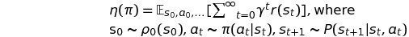

또, kakade&langford(2002)와 해당 논문의 appendix A에 따라, 

다른 policy 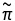의 expected reward를 구하기 쉬운 policy 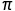를 이용해 구할 수 있는 다음의 식이 유도되었으며,

시간에 따른 표현법을 state에 따른 표현법으로 변환한 식이 다음과 같이 표현될 수 있다.

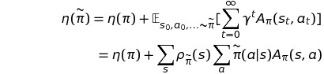

또한, policy 에 대해 advantage를 취한 policy를 라 할 때, 시간에 따라 축적된 expected return은 다음과 같다.

이 수식의 의미는 모든 state에 대해 nonnegative expected advantage를 가진다면 policy performance의 상승을 보장할 수 있다는데에 있다. 물론.. 추정과 근사를 하는 과정에서 error가 존재하므로, 몇몇 state에 대해 negative expected advantage를 가지는것은 불가피하다.

 

아래 식은 performance function 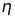에 대한 local approximation 식이다. advantage policy 로부터 직접 sample을 얻어오는것이 어려우므로, 간접적으로 local policy 로부터 얻으려는 것이다.

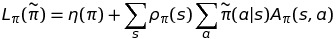

이 local approximation 식이 제대로 performance에 대해 나타낼 수 있을 지에 대한 의문은 다음 식으로부터 해소된다.

policy가 parameterized policy이며 미분가능하다면 performance 의 1차 미분식과 일치한다는 것이다.

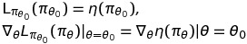

위 식은 충분히 작은 step으로 approximation이 증가하는 방향으로 움직이면, performance 역시 증가한다는 것을 나타낸다. 하지만 <u>얼만큼의 big step까지 이를 보장하는지에 대한 guidance가 없다</u>는 한계가 있다.

 

이 문제를 해결하기 위해  Kakade&Langford(2002)가 **conservative policy interation** 이라는 개념을 제시했다.

바로 위에서 보장하지 못했던 내용에 대한 lower bound를 나타낼 수 있는 식을 제시 하였는데, 기존의 policy를 업데이트함에 있어 approximation error에 의해 Improvement가 보장되지 못할 수 있는 상황을 미연에 방지할 수 있다.

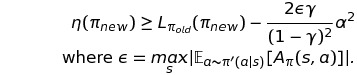

이 식을 본 Schulman은 mixture policy를 업데이트하는데 뿐만 아니라 모든 general stochastic policy에 적용할 수 있는 가능성을 보았고 이를 사용하기로 하였다.

 

### [Monotonic Improvement Guarantee]

이번에는 위 식 *conservative policy iteration bound*를 어떻게 general stochastic policy에 적용되는 지  알아보자.

 기존 식에서의 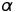는 기존 policy와 새로 current policy간의 업데이트 비율을 결정하는 parameter로서 사용되었다.

이번에는 를 와 간의 distance measure로, 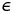을 적절히 변형해주어 아래와 같은 식을 도출하였다.

그리고 두 policy간 distance measure는 **total variation divergence**를 이용하였다.(증명은 appendix 참고)

***Theorem 1.***

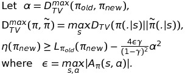

다음으로 total variation divergence 와 **KL divergence** 사이에는 아래와 같은 관계식이 성립한다.

굳이 갑자기 KL divergence로 변환하려는 이유는 모르겠지만, 추후에 advantage function을 estimation하는 과정에서 KL divergence의 Hessian을 구하는 부분이 있는데 이 부분과 관련이 있지 않을까 생각한다.

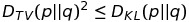

이를 응용해 theorem 1에 대입하면 다음과 같은 식이 성립된다.

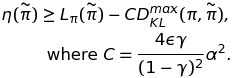

이 식을 이용해 policy iteration을 진행하는 알고리즘 식은 다음과 같으며, 이 식을 통해 지속적으로 performance 증가를 보장하는 policy iteration을 보일 수 있게 되었다.

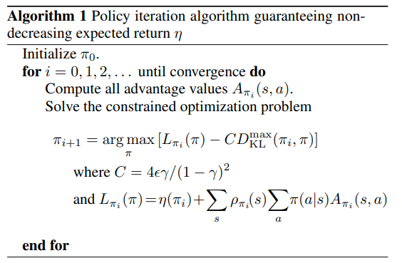

즉, 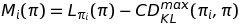일 때, 매 iteration마다 M을 최대화 함으로써 true objective 가 non-decreasing임을 보장할 수 있게 되며, 이는 일종의 minorization-maximization(MM)알고리즘임을 알 수 있다.

MM algorithm에서의 용어로는 함수 M이 바로 surrogate function이라 불린다.

 

### [Optimization of Parameterized Policies]

이번 section부터는 theoretical 기반에서 practical한 알고리즘으로의 전환을 보인다.

policy에 대한 표기 역시 parameter 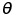에 대한 표기를 사용해 다음과 같은 표현으로 나타낸다.

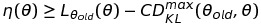

다시 한 번, 정리하자면 surrogate function인 우변의 maximization을 통해 true object 의 개선이 보장된다.

 

하지만, 여기서 practical한 문제가 나타난다.

penalty coefficient C가 실제로는 매우 큰 값이 들어가게 되면서 lower bound에 대한 step size가 매우 작아지기 때문이다. e.g. if discounted_ratio : 0.99, C >= 9.9*10e3

 

조금 더 큰 step size를 얻기 위해서, 해당 논문에서는 KL divergence를 이용해 penalty를 주는 방식이 아닌 아래와 같이 constraint로서 KL divergence를 이용해 `trust region constraint`를 구현해 주었다.

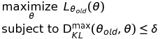

즉, KL divergence metric 값이 일정 범위(hyperparameter) 내에 있는 policy에 대해 surrogate function이 최대가 되도록 하는 policy로 update하는 것이다.

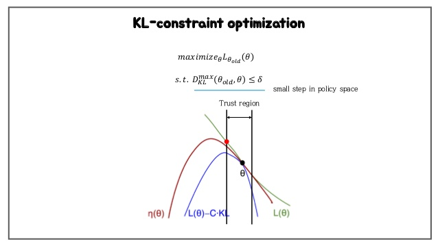

또한 KL Divergence에 대한 max값을 구하는 것이 실질적으로 불가능하기 때문에(모든 state를 방문하는것이 불가능),

다음과 같이 sampling을 통한 KL Divergence의 평균값을 구하는 방식으로 대체한다.

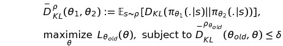

### [Sample-Based Estimation of the Objective and Constraint]

위 식에서 local approximation term을 전개해보면 다음과 같이 나타낼 수 있다.

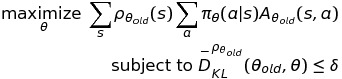

여기서,

1. state에 관한 sum을 visitation frequency에 대한 expectation식으로,
2. advantage function을 Q-function으로(?)
3. importance sampling estimator를 사용해 action에 대한 sum을 대체하도록 하자.

수식으로 표현해보면 다음과 같다.(q는 sampling distribution)

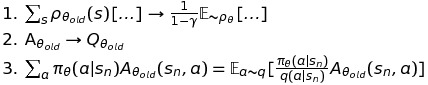 

이를 모두 종합해보면 아래와 같이 수식을 다시 표현할 수 있으며, 가장 general하고 practical한 식이 드디어 도출되었다.

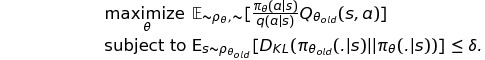

 

위에서 보인 식을 실제로 적용함에 있어,

sampling 방법에 있어 논문에서는 **Single Path** 와 **Vine**에 대해 설명해주고 있는데,

특징만 간단히 정리해보고 자세한건 논문을 참고하도록 하자.

- single path

  old policy에 대해 일련의 states, actions를 모두 수집한 후에 계산된 Q-function으로 policy를 업데이트 해주는 방식으로 가장 일반적으로 사용된다.

- vine

  simple path의 경우 s1->a1->s2->a2 . . .와 같은 방식으로 serialized trajectories를 수집했다면, vine의 경우에는 각 action으로인해 방문할 수 있는 state를 모두 parallelized trajectories방식으로 수집해 더욱 다양한 distribution을 학습하는 방법이다. 당연히 많은 sample에 대해 일반화 할 수 있다는 장점이 있지만 computation이 크고, simulation이 아닌 실제 로봇의 경우 이런방식의 sample수집이 불가능하다는 단점이 있다.

### [Practical Algorithm]

1. single path or vine 방법을 이용해 state-action pairs를 수집하고, Monte Carlo 방식으로 Q-funtion을 근사한다.

2. 수집한 sample들에 대해 average를 취한 후, 아래 수식을 통해 true objective 를 구한다.

   

3. 마지막으로 위 식으로 constrained optimization problem을 풀어 policy의 parameter 를 업데이트 한다.

   해당 논문에서는 conjugate gradient algorithm을 이용해 구해주었다고 한다.(자세한건 논문참조)

